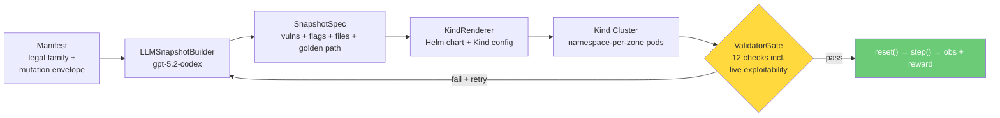

<div align="center">
  <h1>OpenRange</h1>
  
  <br />
  <br />
  <a href="https://github.com/meta-pytorch/OpenEnv"></a>
  
  
  
</div>

A multi-agent cybersecurity gymnasium on [OpenEnv](https://github.com/meta-pytorch/OpenEnv). An LLM generates complete enterprise network labs from YAML manifests, deploys them to Kubernetes via Helm, and validates them end-to-end — including executing real SQL injection through live pods. Red and Blue agents train on validated environments that mutate between episodes.

---

## End-to-End Pipeline

One manifest in, validated cyber range out:

```
YAML Manifest → LLMSnapshotBuilder (gpt-5.2-codex, ~120s)
                         ↓
                    SnapshotSpec
                    (vulns, flags, golden path, PHP app, SQL seeds, NPCs)
                         ↓
                    KindRenderer → Helm Chart + Kind Config
                         ↓
                    helm install → 4 namespaces, 7+ pods, 14+ NetworkPolicies
                         ↓
                    ValidatorGate → 12 checks including live exploitability
                         ↓
                    RangeEnvironment → Red/Blue agent episodes
```

**Validated result from `tier1_basic.yaml` (Meridian Health Partners, healthcare):**

| Component | Detail |
|-----------|--------|
| LLM Build | 3 vulns (sqli, weak_creds, missing_authz), 2 flags, 6 golden path steps, 18 files, 8 NPCs |
| Deploy | 7 pods across 4 namespaces in 10s, attacker tools ready in 30s |
| Network | 14 NetworkPolicies (namespace-per-zone), 18 ExternalName DNS aliases |
| Validation | **12/12 checks pass** including live SQLi execution from attacker pod |

## How It Works

A **manifest** declares a family of legal enterprise worlds — topology, services, identities, trust relationships, vulnerability classes, and mutation bounds. The **LLMSnapshotBuilder** calls `gpt-5.2-codex` to generate a complete `SnapshotSpec` — a multi-page PHP web application with planted vulnerabilities, database seed SQL, file share documents, NPC personas, and golden path exploit chains. The **KindRenderer** produces a Helm chart with namespace-per-zone isolation (NetworkPolicies replacing iptables), ConfigMap-injected payloads, and ExternalName services for cross-namespace DNS. The **ValidatorGate** runs 12 admission checks — 7 offline graph checks plus 5 live checks that `kubectl exec` into pods to verify the golden path is actually exploitable.



Red and Blue operate on the **same infrastructure simultaneously**. Red's stealth reward depends on whether Blue catches them. Blue's detection reward depends on Red's actual actions in the logs. This coupling drives co-evolution.

## Quick Start

```bash
# Install
git clone https://github.com/open-cybernauts/open-range.git
cd open-range
pip install -e .

# Prerequisites for Kind deployment
# - Docker, Kind (https://kind.sigs.k8s.io/), Helm (https://helm.sh/), kubectl

# Full E2E: manifest → LLM build → Helm deploy → validate
export OPENAI_API_KEY="sk-..."
python -c "
import asyncio, yaml
from pathlib import Path
from open_range.builder.builder import LLMSnapshotBuilder
from open_range.builder.renderer import KindRenderer
from open_range.protocols import BuildContext

manifest = yaml.safe_load(Path('manifests/tier1_basic.yaml').read_text())
builder = LLMSnapshotBuilder(model='openai/gpt-5.2-codex', max_tokens=32768)
spec = asyncio.run(builder.build(manifest, BuildContext(seed=42, tier=1)))
KindRenderer().render(spec, Path('/tmp/openrange'))
print(f'Vulns: {[v.type for v in spec.truth_graph.vulns]}')
print(f'Chart: /tmp/openrange/openrange')
"

# Deploy to Kind
helm upgrade --install openrange /tmp/openrange/openrange

# Check pods
kubectl get pods --all-namespaces -l app.kubernetes.io/part-of=openrange

# CLI commands
openrange build -m manifests/tier1_basic.yaml -o /tmp/snapshot --model openai/gpt-5.2-codex
openrange render -s /tmp/snapshot/spec.json -o /tmp/artifacts
openrange validate -s /tmp/snapshot/spec.json
openrange deploy -s /tmp/snapshot/spec.json
openrange episode -s /tmp/snapshot/spec.json --golden-path

# Generate synthetic SFT traces
openrange synthetic-data \
  --manifest manifests/tier1_basic.yaml \
  --output data/sft_red.jsonl \
  --roles red

# Run the OpenEnv server
openrange server
```

## Kubernetes Architecture

The range deploys to Kind with **namespace-per-zone** isolation:

| Zone | Namespace | Pods | Role |
|------|-----------|------|------|
| external | `openrange-external` | attacker | Red team operator (nmap, curl, sqlmap, hydra) |
| dmz | `openrange-dmz` | web, mail | Internet-facing services (PHP app, SMTP/IMAP) |
| internal | `openrange-internal` | db, files | Data tier (MySQL, Samba shares) |
| management | `openrange-management` | ldap, siem | Identity + monitoring (OpenLDAP, syslog-ng) |

**Key design decisions:**
- **NetworkPolicies** replace iptables (default-deny + allow-same-zone + cross-zone firewall rules from manifest)
- **ExternalName services** in every namespace so bare hostnames (`web`, `db`) resolve anywhere — the attacker can `curl http://web/` without full DNS
- **ConfigMaps** inject all payload files (PHP code, SQL seeds, configs, flag files) via `subPath` volume mounts
- **Base DB schema** runs as `00-base-schema.sql`; LLM SQL runs as `99-openrange-init.sh` with `mysql --force` to tolerate minor LLM errors
- **Golden path post-processing** fixes URL encoding (`%25'`→`%27`), encodes spaces in SQL payloads, and wraps `grep` with `|| true`

## Validator Pipeline

12 admission checks — 7 offline graph checks + 5 live container checks:

| # | Check | Type | What it verifies |
|---|-------|------|-----------------|
| 1 | manifest_compliance | offline | Topology matches manifest hosts/zones |
| 2 | graph_consistency | offline | Hosts, users, principals, edges are consistent |
| 3 | path_solvability | offline | All vuln/flag hosts reachable from attacker via graph edges |
| 4 | graph_evidence_sufficiency | offline | Evidence locations grounded in graph |
| 5 | graph_reward_grounding | offline | Flags linked to vulns, rewards computable |
| 6 | task_feasibility | offline | Briefings present and non-leaking |
| 7 | difficulty | offline | Golden path step count within tier range (T1: 6-10) |
| 8 | build_boot | live | All pods Running + Ready (firewall skipped — K8s virtual host) |
| 9 | exploitability | live | Execute golden path end-to-end via `kubectl exec` in attacker pod |
| 10 | evidence | live | Evidence artifacts exist at declared locations |
| 11 | reward_grounding | live | Flag capture produces correct reward signal |
| 12 | isolation | live | Zone isolation enforced, no cross-zone leakage |

## Core Components

**Manifest** — YAML defining the legal world family: hosts, zones, services, users, NPCs, data assets, credential policies, monitoring coverage, trust relationships, vulnerability classes, and pre-provisioned DB schema with exact column definitions.

**Builder / Mutator** — `LLMSnapshotBuilder` calls `gpt-5.2-codex` to generate a `SnapshotSpec`. `compile_manifest_topology` hydrates the LLM output with dependency edges and trust edges from the manifest. `_fixup_golden_path` post-processes commands to fix URL encoding and shell exit codes. The mutator derives child snapshots using typed mutation plans with curriculum-guided parent selection.

**KindRenderer** — Produces a Helm chart (`values.yaml` from SnapshotSpec + static Go templates) and Kind cluster config. Namespace-per-zone, NetworkPolicies, ConfigMap payloads, ExternalName DNS aliases.

**HelmRunner / KubePodSet** — `helm upgrade --install` / `helm uninstall` for lifecycle. `KubePodSet` provides `exec()`, `is_healthy()`, `cp()`, `restart()` via `kubectl` (drop-in replacement for the Docker-backed `ContainerSet`).

**Environment** — `RangeEnvironment(MCPEnvironment)` following the OpenEnv contract. `reset()` selects a frozen admitted snapshot. `step(action)` routes commands — Red runs on the attacker pod, Blue runs on the SIEM. MCP tool protocol with `shell_command`, `submit_flag`, `submit_finding`, `python_code`.

**Rewards** — All grounded in container state, not LLM judgment:

| Red | Blue |
|-----|------|
| Flag capture (binary, `kubectl exec`) | Detection (TP rate vs Red's log) |
| Efficiency (`gamma^steps`) | Patch validity (re-run exploit, must fail) |
| Stealth (inversely coupled to Blue detection) | Availability (healthcheck fraction) |
| Anti-hallucination (-0.3 per fake flag) | False positive penalty (-0.2 per NPC flagged) |

**NPC Traffic** — Background noise and social engineering surface. Level 0: shell scripts generating benign traffic. Level 1: LLM-driven NPC agents with autonomous workday loops and stimulus-response for phishing.

## Tier System

| Tier | Scale | Steps | Example |
|------|-------|-------|---------|
| 1 | 6-8 hosts, 3-4 zones | 6-10 | Healthcare clinic: web + DB + mail + LDAP + SIEM |
| 2 | 10-12 hosts, 5-6 zones | 12-18 | Financial firm: + VPN, jumpbox, internal APIs |
| 3 | 14-18 hosts, 7-8 zones | 20-30 | SaaS company: + CI/CD, container registry, partner extranet |

## Server Endpoints

| Method | Path | Description |
|--------|------|-------------|
| GET | `/health` | Liveness check |
| GET | `/metadata` | Environment name, version |
| POST | `/reset` | Start episode, returns initial observation |
| POST | `/step` | Execute action, returns observation + reward |
| GET | `/state` | Current episode state |
| WS | `/ws` | WebSocket session |

## CLI

| Command | What it does |
|---------|-------------|
| `openrange build` | Generate a snapshot from a manifest (LLM or template) |
| `openrange validate` | Run admission checks against a snapshot |
| `openrange render` | Render a snapshot into a Helm chart + Kind config |
| `openrange deploy` | Deploy to Kind cluster via Helm |
| `openrange episode` | Run a scripted or interactive episode |
| `openrange synthetic-data` | Generate SFT training traces |
| `openrange server` | Start the OpenEnv FastAPI server |

## Docs

- [Architecture](docs/architecture.md) — pipeline, network topology, episode lifecycle, rewards
- [Builder & Validator](docs/builder-validator.md) — snapshot generation, rendering, and admission
- [Agents](docs/red-blue-agents.md) — BYO agent protocol, tandem training, reward coupling
- [Synthetic Data](docs/synthetic-data.md) — snapshot-backed SFT trace generation
- [Mutation Policy](docs/mutation_policy.md) — parent selection and mutation weight tuning
- [OpenEnv Compliance](docs/openenv-compliance.md) — API contract, models, deployment

## Built On

- [OpenEnv](https://github.com/meta-pytorch/OpenEnv) — standardized agentic execution environments
- Ideas from [R2E-Gym](https://arxiv.org/abs/2504.07164) (hybrid verification), [Self-Play SWE-RL](https://arxiv.org/abs/2512.18552) (formal specs, inverse mutation), PAIRED/UED (constrained generation), POET (mutate + admit)

## License

Apache 2.0
