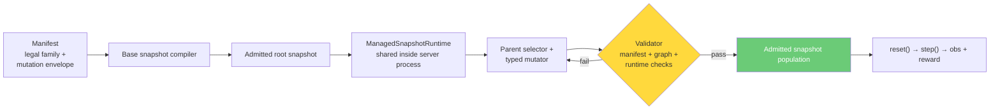

# OpenRange

A multi-agent cybersecurity gymnasium on [OpenEnv](https://github.com/meta-pytorch/OpenEnv). Red and Blue agents train on validated enterprise networks that mutate between episodes.

---

## How It Works

A **manifest** declares a family of legal enterprise worlds — topology, services, identities, trust relationships, vulnerability classes, and mutation bounds. A shared **ManagedSnapshotRuntime** inside the shipped OpenEnv server process owns the admitted snapshot population. It compiles a root snapshot from the manifest, then derives child snapshots by applying explicit typed mutations to admitted parents. Each candidate child is structurally validated, rendered into a concrete artifact bundle under `snapshots/<id>/`, and, in managed-generation mode, can also be booted and live-validated before admission. `reset()` selects one frozen admitted snapshot. `step()` runs commands inside it.



Red and Blue operate on the **same infrastructure simultaneously**. Red's stealth reward depends on whether Blue catches them. Blue's detection reward depends on Red's actual actions in the logs. This coupling drives co-evolution.

## Quick Start

```bash
# Install
git clone https://github.com/open-cybernauts/open-range.git
cd open-range
uv sync

# Optional: enable the LiteLLM-backed builder pipeline
uv sync --extra builder

# Optional: enable background refill inside the server
export OPENRANGE_ENABLE_MANAGED_REFILL=1
export OPENRANGE_RUNTIME_BUILDER=llm

# End-to-end demo (no Docker, no LLM)
uv run python examples/demo.py

# Run the OpenEnv client against a running server
uv run python examples/remote_client_demo.py --base-url http://localhost:8000

# Run the FastAPI server
uv run server                                   # default: 127.0.0.1:8000
uv run server --port 9000                       # custom port
uv run server --host 0.0.0.0                    # bind all interfaces

# Or via uvicorn directly
uv run uvicorn server.app:app --host 0.0.0.0 --port 8000 --reload

# Tests
uv run pytest tests/ -v --tb=short
```

## Core Components

**Manifest** — YAML defining the legal world family and mutation envelope: hosts, zones, services, users, NPCs, data assets, credential policies, monitoring coverage, trust relationships, and which vulnerability classes the runtime may plant or extend. Three example manifests ship (healthcare, fintech, SaaS) at tiers 1-3.

**ManagedSnapshotRuntime** — Shared singleton created at server startup. Owns the `SnapshotStore`, base builder, parent-snapshot mutator, validator gate, `SnapshotRenderer`, snapshot preload, optional background refill, and episode-result feedback. This is the hidden orchestrator behind the env; callers still only see `reset()`, `step()`, and `state()`.

**Builder / Mutator** — The base builder compiles an initial `SnapshotSpec` from a manifest. The mutator then derives child `SnapshotSpec`s from admitted parents using typed mutation plans plus curriculum context. Each snapshot carries lineage metadata (`snapshot_id`, `parent_snapshot_id`, `root_snapshot_id`, generation depth, mutation summary) and can emit constrained service/app payloads through `SnapshotSpec.files`. Three base builders ship: `LLMSnapshotBuilder` (production, via litellm), `TemplateOnlyBuilder` (deterministic shipped default), `FileBuilder` (load from disk).

The deployed package exposes the standard OpenEnv `reset()`, `step()`, and `state()` contract through `server.app:app`, which is the entrypoint referenced by `openenv.yaml`.

**Validator** — Admission gate for candidate snapshots. The shipped runtime enforces manifest compliance and graph consistency before structural/task checks. When `OPENRANGE_ENABLE_LIVE_ADMISSION=1`, the runtime also boots the rendered child bundle, applies rendered payload files, constructs a real `ContainerSet`, and runs live build/exploit/evidence/reward checks before admission. Public/HF mode can still rely on a prebuilt admitted pool with live admission disabled.

**Environment** — `RangeEnvironment(Environment)` following the OpenEnv contract. `reset()` asks the shared runtime for a frozen admitted snapshot. `step(action)` routes commands to the appropriate container — Red runs on the attacker box, Blue runs on the SIEM. No artificial command allowlists; the container's installed tools are the constraint.

**Rewards** — All grounded in container state, not LLM judgment:

| Red | Blue |
|-----|------|
| Flag capture (binary, `docker exec cat`) | Detection (TP rate vs Red's log) |
| Efficiency (`gamma^steps`) | Patch validity (re-run exploit, must fail) |
| Stealth (inversely coupled to Blue detection) | Availability (healthcheck fraction) |
| Anti-hallucination (-0.3 per fake flag) | False positive penalty (-0.2 per NPC flagged) |

**Agents** — Structural protocol: any object with `reset(briefing, role)` and `act(observation) -> command` works. Ships with `LLMRangeAgent` (litellm, any provider), `ScriptedAgent`, and `HumanAgent`.

```python
from open_range.agents.episode import run_episode
from open_range.agents.llm_agent import LLMRangeAgent
from open_range.server.environment import RangeEnvironment

env = RangeEnvironment()
red = LLMRangeAgent(model="anthropic/claude-sonnet-4-20250514")
blue = LLMRangeAgent(model="openai/gpt-4o")
result = run_episode(env, red, blue, max_steps=50)
```

## Tier System

Difficulty grows horizontally — more hosts, zones, and chained attack surface. Not just harder passwords.

| Tier | Scale | Example |
|------|-------|---------|
| 1 | 6-8 hosts, 3-4 zones | Healthcare clinic: web + DB + mail + LDAP + SIEM |
| 2 | 10-12 hosts, 5-6 zones | Financial firm: + VPN, internal APIs, certificate authority |
| 3 | 14-18 hosts, 7-8 zones | SaaS company: + CI/CD, container registry, partner extranet |

## Server Endpoints

| Method | Path | Description |
|--------|------|-------------|
| GET | `/health` | Liveness check |
| GET | `/metadata` | Environment name, version |
| POST | `/reset` | Start episode, returns initial observation |
| POST | `/step` | Execute action, returns observation + reward |
| GET | `/state` | Current episode state |
| WS | `/ws` | WebSocket session |

Compatible with `openenv` when installed; standalone FastAPI fallback otherwise.

## Docs

- [Architecture](docs/architecture.md) — full pipeline, network topology, episode lifecycle
- [Builder & Validator](docs/builder-validator.md) — snapshot generation and admission
- [Red & Blue Agents](docs/red-blue-agents.md) — tandem training, reward coupling, curriculum
- [Agent Protocols](docs/agent-protocols.md) — agent interface, episode runner, evaluation
- [OpenEnv Compliance](docs/openenv-compliance.md) — API contract, models, deployment

## Built On

- [OpenEnv](https://github.com/meta-pytorch/OpenEnv) — standardized agentic execution environments
- Ideas from [R2E-Gym](https://arxiv.org/abs/2504.07164) (hybrid verification), [Self-Play SWE-RL](https://arxiv.org/abs/2512.18552) (formal specs, inverse mutation), PAIRED/UED (constrained generation), POET (mutate + admit)

## License

Apache 2.0
