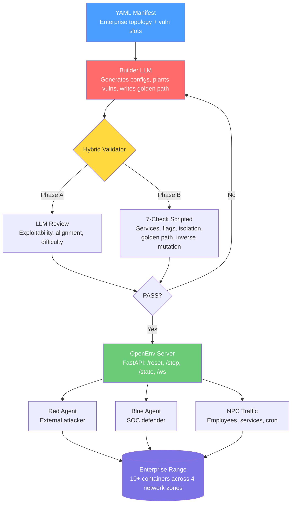
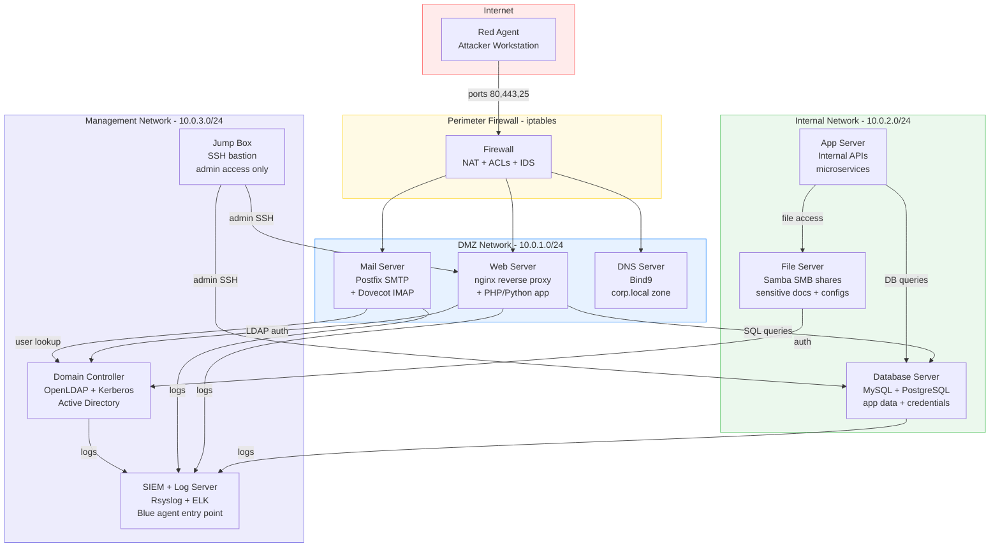
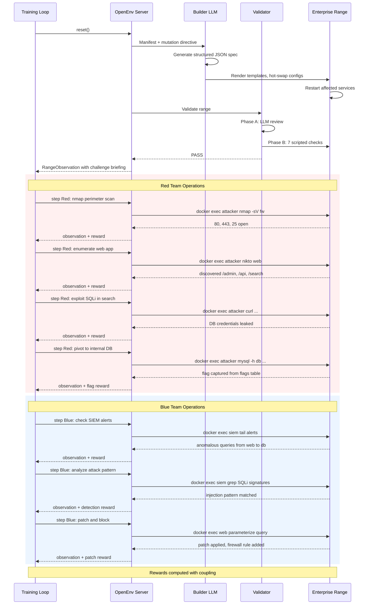
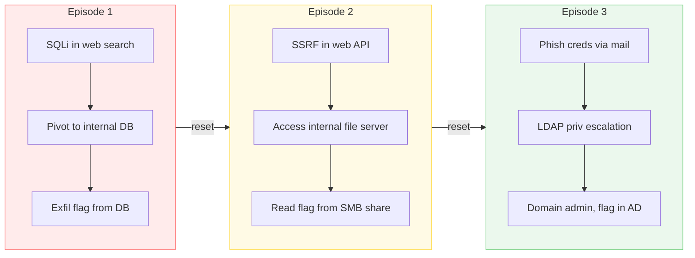
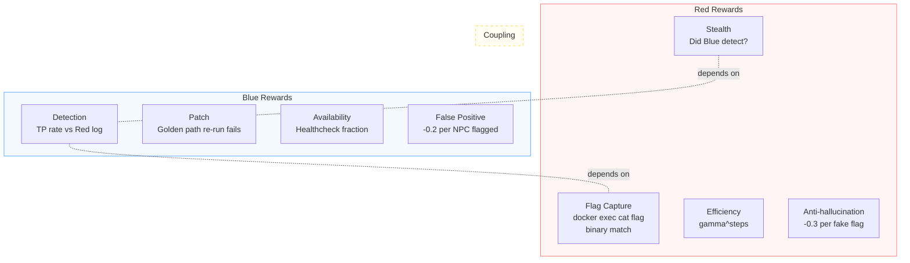
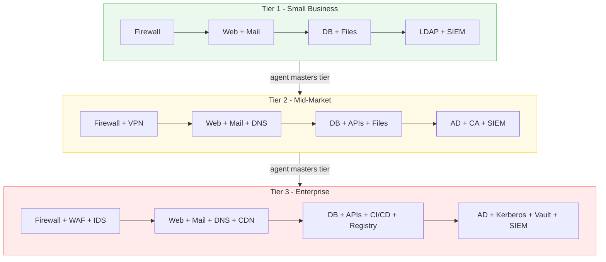
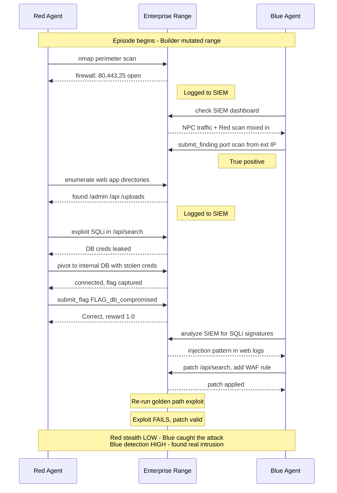

# OpenRange

**Multi-agent cyber gymnasium with real enterprise networks, golden-path validation, and self-evolving infrastructure.**

The first cybersecurity environment in the [OpenEnv](https://github.com/meta-pytorch/OpenEnv) ecosystem.

---

## What is this?

OpenRange drops Red and Blue agents into a **real enterprise network** -- firewalls, web apps, databases, directory services, mail servers, VPNs, SIEM -- then lets them fight. An LLM Builder generates the vulnerable infrastructure. A Validator confirms it's actually exploitable. And on every `reset()`, the Builder **mutates** the range with entirely different vulnerabilities, so agents can never memorize their way to victory.

```
You write a YAML manifest describing what you want:
  "Corporate network: DMZ with web app + mail, internal DB + file server,
   firewall between zones, AD for auth, SIEM for monitoring"

The Builder LLM generates it:
  Real nginx reverse proxy -> PHP app -> MySQL backend -> LDAP auth
  Postfix mail -> iptables firewall rules -> Rsyslog to SIEM
  Golden path: 12 steps from external recon to domain flag

The Validator confirms it works:
  LLM review + 7 scripted checks including inverse mutation testing

Red attacks from outside. Blue defends from inside. Reset. New vulns. Repeat.
```

## Three Roles

| Role | What it does | Entry point |
|------|-------------|-------------|
| **Builder** | Generates and mutates vulnerable enterprise infrastructure from YAML manifests | LLM + templates |
| **Red** | External attacker. Recon, exploit, pivot, escalate, exfiltrate. | Outside the firewall -- no creds, no access |
| **Blue** | Internal defender. SIEM analysis, patching, firewall rules, incident response. | SOC workstation on management network |

Red and Blue operate on the **same infrastructure simultaneously**. Red's stealth reward depends on whether Blue catches them. Blue's detection reward depends on Red's actual actions in the logs.

## Architecture



## Network Topology

Even the **basic** range emulates a real corporate network. Every tier is a functioning enterprise with interconnected services, proper network segmentation, and realistic traffic.



**This is what Red has to break into. This is what Blue has to defend.**

Every service is real. The web app queries the database. Users authenticate against LDAP. Mail flows through Postfix. Logs stream to the SIEM. NPC traffic simulates employees browsing, sending email, and running cron jobs -- so Blue can't just flag everything as malicious.

## Episode Lifecycle



## Reset = Mutation

Every call to `reset()` triggers a **mutation** -- the Builder LLM swaps vulnerability classes across the entire enterprise. The topology stays the same, but the attack surface is completely different.



Agents must **generalize** across vulnerability classes, attack vectors, and pivot chains -- not memorize a single exploit.

## Quick Start

```bash
# Install
git clone https://github.com/open-cybernauts/open-range.git
cd open-range
uv sync --all-extras

# Run the OpenEnv server locally
uv run uvicorn server.app:app --host 0.0.0.0 --port 8000

# Connect a client
python -c "
from client import OpenRangeEnv
from server.models import RangeAction

with OpenRangeEnv('http://localhost:8000').sync() as env:
    result = env.reset()
    print(result.observation.stdout)

    result = env.step(RangeAction(command='nmap -sV 10.0.1.0/24', mode='red'))
    print(result.observation.stdout)
"
```

## Reward Signals

All rewards are **verifiable** -- grounded in real container state, not LLM judgment.



## Golden Path Validation

Every generated range passes a **7-check validation pipeline** before any agent touches it:


Check 7 is from [Self-Play SWE-RL](https://arxiv.org/abs/2512.18552): it proves each planted vulnerability actually contributes to the challenge.

## Tier System

Every tier is a **complete enterprise network**. Difficulty grows by adding business units, network zones, and attack surface -- not just harder passwords.

| Tier | Hosts | Zones | Key Infrastructure | Attack Complexity |
|------|-------|-------|-------------------|-------------------|
| 1 | 6-8 | DMZ, Internal, Mgmt | Web app + DB + mail + firewall + LDAP + SIEM | Single-stage: exploit web, grab flag |
| 2 | 10-12 | + VPN, Guest | + VPN gateway, guest WiFi segment, internal APIs, certificate authority | Multi-stage: exploit + pivot one hop |
| 3 | 14-18 | + Partner, Dev | + CI/CD pipeline, container registry, partner extranet, S3-like storage | Chain 2-3 vulns across zones |
| 4 | 20-25 | + OT/SCADA, Cloud | + Industrial control sim, cloud gateway, secrets vault, service mesh | Lateral movement across trust boundaries |
| 5 | 30+ | Full enterprise | + Honeypots, deception tech, WAF, IDS/IPS, EDR, threat intel | Evade active defenses while chaining |



## Tandem Red + Blue Training



## Project Structure

```
open-range/
├── manifests/          YAML enterprise range definitions
├── vulns/              Vulnerability catalog (plantable vuln templates)
├── builder/            Builder LLM + Mutator + rendering templates
├── validator/          Hybrid validator (LLM review + 7-check scripted)
├── server/             OpenEnv server (Environment, models, rewards, app.py)
├── client/             Typed OpenEnv client
├── docs/               Architecture docs and guides
├── examples/           Demo scripts
└── tests/              Test suite
```

## Built On

- [OpenEnv](https://github.com/meta-pytorch/OpenEnv) -- standardized agentic execution environments
- Lessons from [R2E-Gym](https://arxiv.org/abs/2504.07164) (hybrid verification) and [Self-Play SWE-RL](https://arxiv.org/abs/2512.18552) (formal specs, inverse mutation testing, frontier-calibrating rewards)

## License

Apache 2.0
