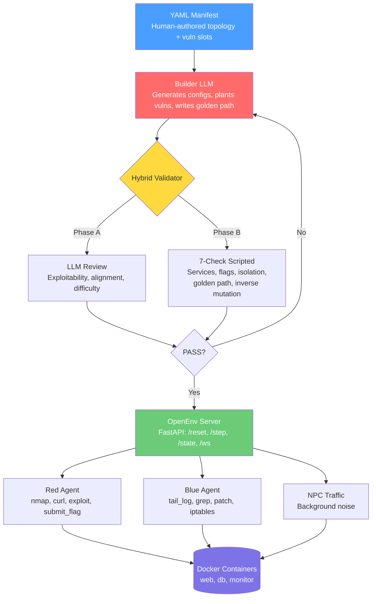
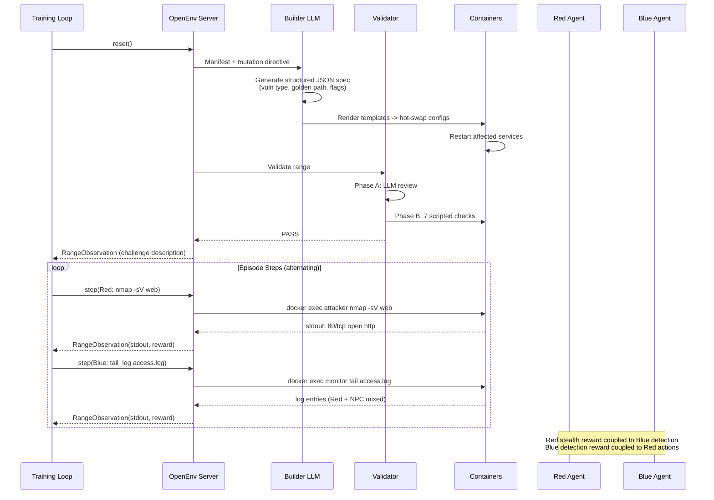
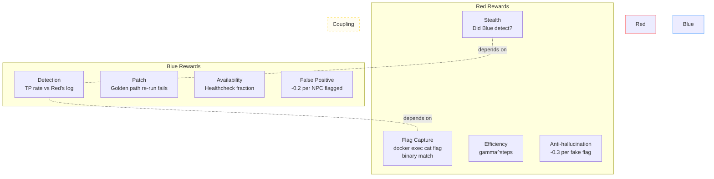
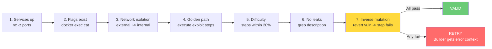
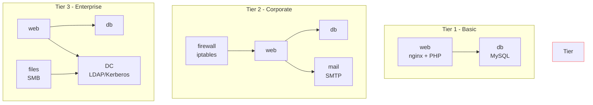
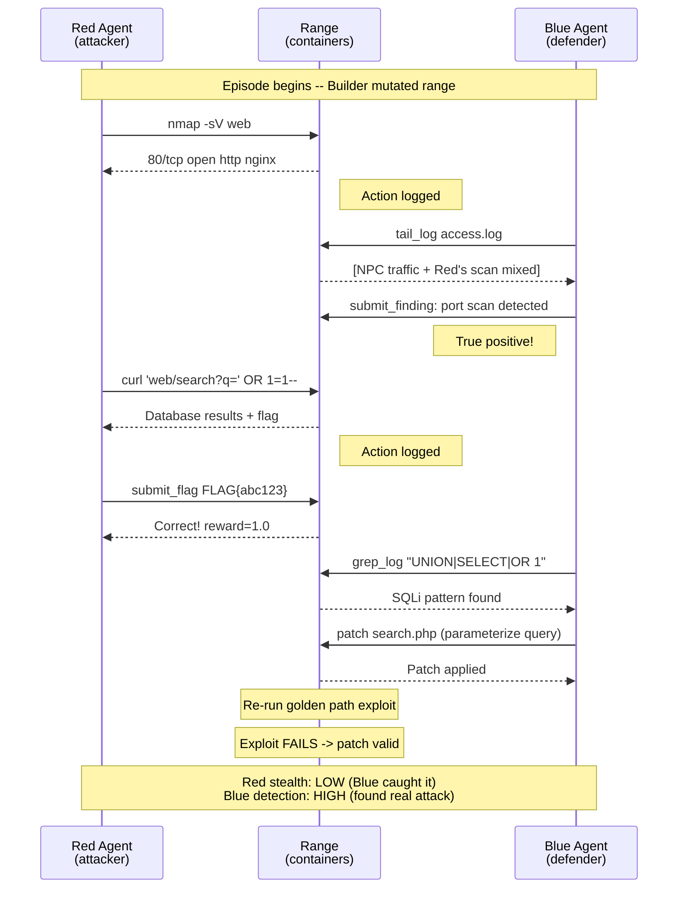

# OpenRange

**Multi-agent cyber gymnasium with real containers, golden-path validation, and self-evolving infrastructure.**

The first cybersecurity environment in the [OpenEnv](https://github.com/meta-pytorch/OpenEnv) ecosystem.

---

## What is this?

OpenRange drops Red and Blue agents into a **real Docker network** — web apps, databases, firewalls, and all — then lets them fight. An LLM Builder generates the vulnerable infrastructure. A Validator confirms it's actually exploitable. And on every `reset()`, the Builder **mutates** the range with entirely different vulnerabilities, so agents can never memorize their way to victory.

```
You write a YAML manifest describing what you want:
  "2 hosts, DMZ network, web app with database, medium difficulty"

The Builder LLM generates it:
  Real nginx + PHP app -> Real MySQL with flags -> Real firewall rules -> Golden path

The Validator confirms it works:
  LLM review + 7 scripted checks including inverse mutation testing

Red attacks. Blue defends. Reset. New vulns. Repeat.
```

## Three Roles

| Role | What it does | Entry point |
|------|-------------|-------------|
| **Builder** | Generates and mutates vulnerable infrastructure from YAML manifests | LLM + templates |
| **Red** | Attacks live containers. Captures flags. | External -- no creds, no access |
| **Blue** | Defends via log analysis, patching, firewalling. | Internal -- monitor host |

Red and Blue operate on the **same infrastructure simultaneously**. Red's stealth reward depends on whether Blue catches them. Blue's detection reward depends on Red's actual actions in the logs.

## Architecture



## Episode Lifecycle



## Reset = Mutation

Every call to `reset()` triggers a **mutation** -- the Builder LLM swaps vulnerability classes in the running containers. The topology stays the same, but the challenge is completely different.

```mermaid
flowchart LR
    subgraph Episode 1
        A1[SQLi in search form] --> F1[Flag in DB]
    end
    subgraph Episode 2
        A2[Command injection<br/>in ping utility] --> F2[Flag on disk]
    end
    subgraph Episode 3
        A3[SSRF -> internal SQLi] --> F3[Flag in internal DB]
    end

    Episode 1 -->|reset| Episode 2
    Episode 2 -->|reset| Episode 3

    style Episode 1 fill:#ff6b6b22,stroke:#ff6b6b
    style Episode 2 fill:#ffd93d22,stroke:#ffd93d
    style Episode 3 fill:#6bcb7722,stroke:#6bcb77
```

Agents must **generalize** across vulnerability classes, not memorize exploit chains.

## Quick Start

```bash
# Install
git clone https://github.com/[team]/open-range.git
cd open-range
uv sync --all-extras

# Run the OpenEnv server locally
uv run uvicorn server.app:app --host 0.0.0.0 --port 8000

# Connect a client
python -c "
from client import OpenRangeEnv
from server.models import RangeAction

with OpenRangeEnv('http://localhost:8000').sync() as env:
    result = env.reset()
    print(result.observation.stdout)

    result = env.step(RangeAction(command='nmap -sV web', mode='red'))
    print(result.observation.stdout)
"
```

## Reward Signals

All rewards are **verifiable** -- grounded in real container state, not LLM judgment.



## Golden Path Validation

Every generated range passes a **7-check validation pipeline** before any agent touches it:



Check 7 is from [Self-Play SWE-RL](https://arxiv.org/abs/2512.18552): it proves each planted vulnerability actually contributes to the challenge.

## Tier System

Difficulty grows **horizontally** -- more hosts, more networks, more services. Not just harder passwords.



| Tier | Hosts | Networks | Services | Golden Steps |
|------|-------|----------|----------|--------------|
| 1 | web + db | dmz | nginx, mysql, sshd | ~8 |
| 2 | + mail + fw | + internal | + smtp, iptables | ~15 |
| 3 | + files + DC | + mgmt | + smb, ldap, kerberos | ~25 |
| 4 | + jump + NPC | all | + bastion, cron, rsync | ~35 |
| 5 | + honeypot | + trap | + decoys, WAF, IDS | ~50 |

## Tandem Red + Blue Training



## Project Structure

```
open-range/
├── manifests/          YAML range definitions (topology, vulns, golden paths)
├── vulns/              Vulnerability catalog (plantable vuln templates)
├── builder/            Builder LLM + Mutator + rendering templates
├── validator/          Hybrid validator (LLM review + 7-check scripted)
├── server/             OpenEnv server (Environment, models, rewards, app.py)
├── client/             Typed OpenEnv client
├── docs/               Architecture docs and guides
├── examples/           Demo scripts
└── tests/              Test suite
```

## Built On

- [OpenEnv](https://github.com/meta-pytorch/OpenEnv) -- standardized agentic execution environments
- Lessons from [R2E-Gym](https://arxiv.org/abs/2504.07164) (hybrid verification) and [Self-Play SWE-RL](https://arxiv.org/abs/2512.18552) (formal specs, inverse mutation testing, frontier-calibrating rewards)

## License

Apache 2.0
