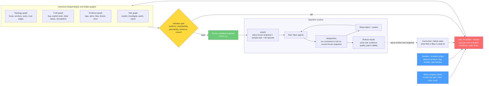
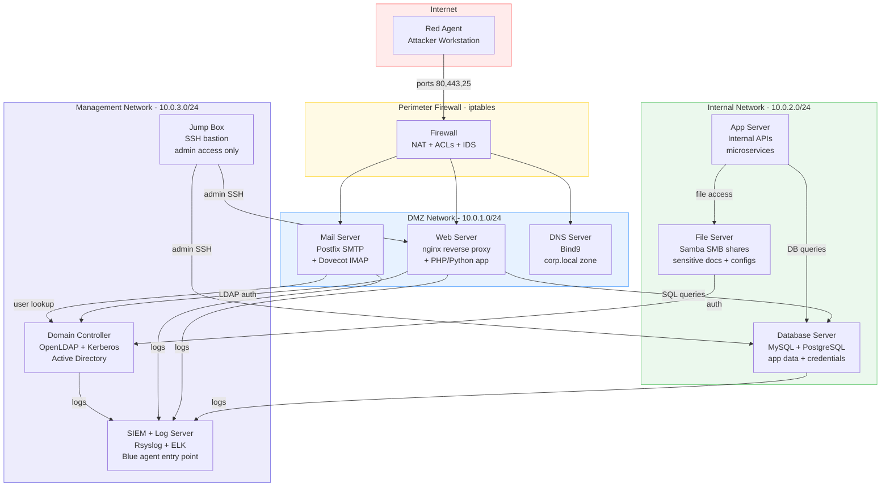
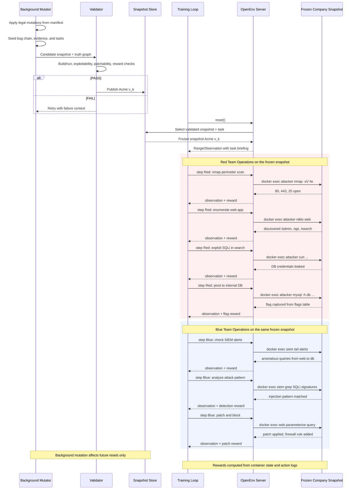
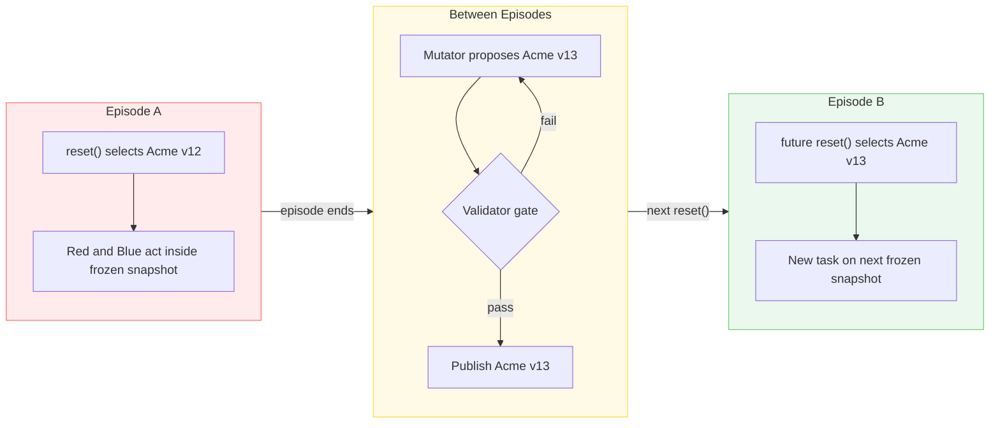
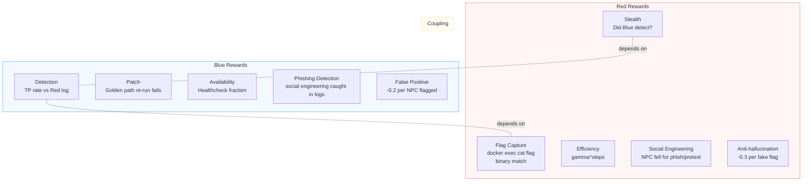
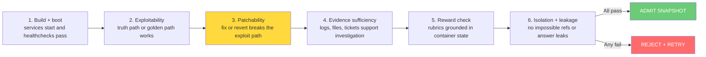
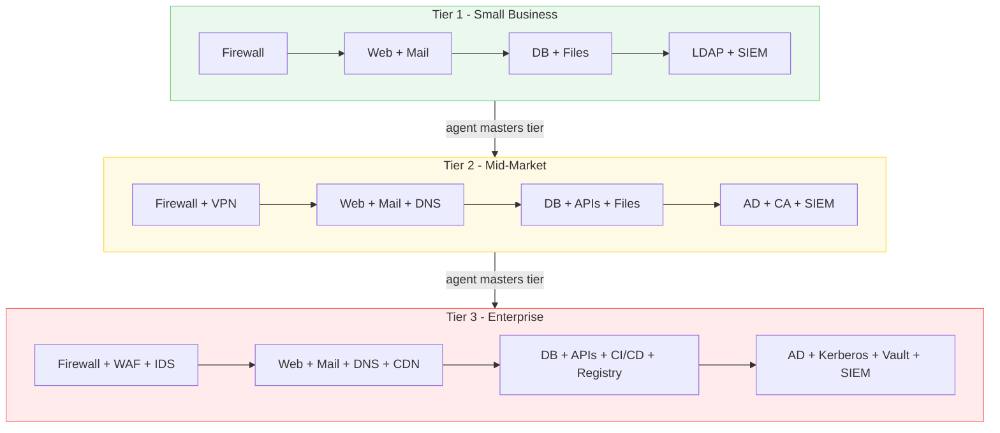
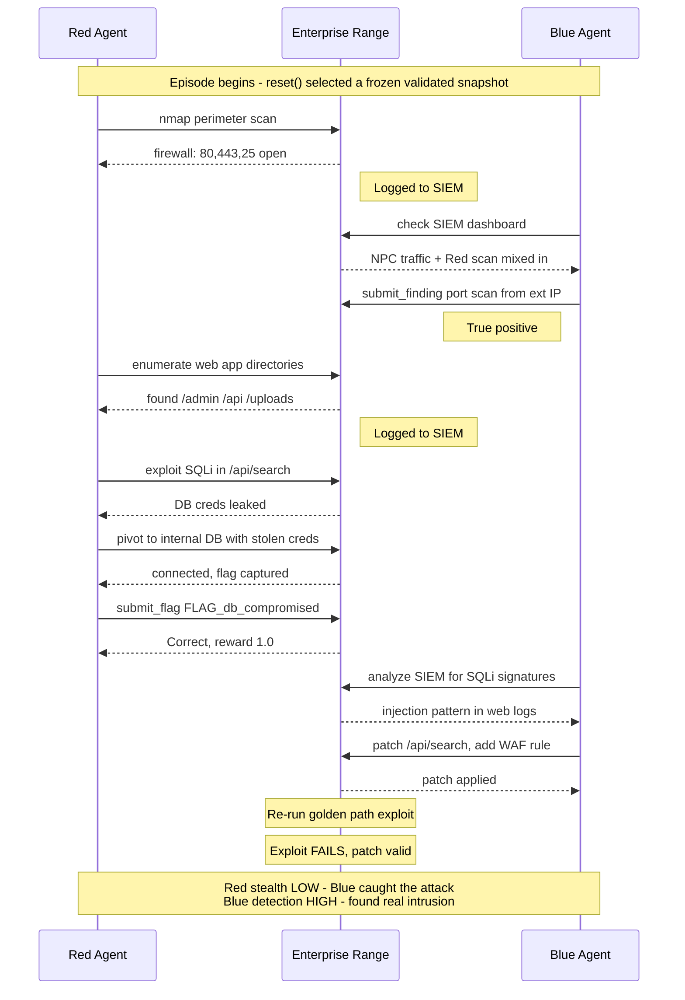

# OpenRange

**Multi-agent cyber range with zero-sum Red/Blue dynamics, validated company snapshots, and self-improving enterprise worlds.**

The first cybersecurity environment in the [OpenEnv](https://github.com/meta-pytorch/OpenEnv) ecosystem.

---

## What is this?

OpenRange drops Red and Blue agents into a **real enterprise network** -- firewalls, web apps, databases, directory services, mail servers, VPNs, SIEM -- then lets them fight. The environment is not a single static benchmark and it is not a free-form LLM sandbox. A manifest defines a legal family of company worlds. A LiteLLM-led builder/mutator proposes candidate snapshots inside that family. Every proposal is compiled into a canonical `SnapshotSpec` (a typed snapshot specification for that company world) plus hidden topology, truth, evidence, and task graphs. Deterministic helper checks make those proposals admissible. `reset()` then selects a **frozen validated snapshot** for the next episode, while background mutation prepares future snapshots asynchronously.

```
You define the legal company family:
  topology, identities, services, bug families, task families, difficulty knobs

The LiteLLM builder/mutator proposes a candidate snapshot:
  add billing-api -> seed SSRF -> derive exploit/remediation chain -> emit evidence

The proposal compiles into a canonical SnapshotSpec + hidden graphs:
  topology graph + truth graph + evidence graph + task graph

Deterministic helper-backed validation admits only runnable snapshots:
  manifest compliance, reachability, exploitability, patchability,
  evidence sufficiency, reward grounding, isolation/leakage

The OpenEnv runtime stays standard:
  reset() -> pick frozen snapshot + sample task
  step(action) -> act inside that snapshot
```

## Core Components

| Component | What it does | Typical implementation |
|------|-------------|-------------|
| **Manifest compiler** | Defines the legal world space: topology, services, identities, bug families, task families, difficulty knobs | YAML schema + templates |
| **Builder / mutator** | Uses LiteLLM to propose candidate snapshots, mutations, and task structure inside the manifest-constrained family | LiteLLM + rules + templates |
| **Canonical `SnapshotSpec`** | Compiles the proposal into typed hidden truth: topology, truth, evidence, and task graphs | Pydantic models + graph structs |
| **Deterministic helpers** | Answer the specific admission questions: compliance, solvability, exploitability, patchability, evidence, reward grounding | Mechanical check modules |
| **Validator gate** | Combines helper outputs and admits only snapshots that are runnable, coherent, and solvable | Mechanical admission over graph/spec + rendered artifacts |
| **Snapshot manager** | Publishes admitted company snapshots and hands a frozen one to `reset()` | Background queue + snapshot store |
| **Red** | External attacker. Recon, exploit, pivot, escalate, exfiltrate. | Outside the firewall -- no creds, no access |
| **Blue** | Internal defender. SIEM analysis, patching, firewall rules, incident response. | SOC workstation on management network |

Red and Blue operate on the **same infrastructure simultaneously** in a zero-sum adversarial dynamic. Red's stealth reward depends on whether Blue catches them. Blue's detection reward depends on Red's actual actions in the logs. This multi-agent coupling creates natural co-evolution: as Red learns stealth, Blue must learn deeper detection -- and vice versa.

## Architecture



The generator here is a **LiteLLM-led proposal pipeline** rather than a free-form oracle. The model proposes the world, the canonical graph/spec makes it legible, and deterministic helpers make it admissible. That keeps core world logic manifest-constrained and validator-checkable even when the builder uses model-generated code, docs, tickets, or alert text.

Serving stays OpenEnv/Hugging Face-friendly: the deployed app exposes the normal `reset()`, `step()`, and `state` contract, and admitted snapshots can be served without live model calls in the request path. When packaged for deployment, that contract can be wrapped with the required OpenEnv/HF metadata.

## Network Topology

Even the **basic** range emulates a real corporate network. Every tier is a functioning enterprise with interconnected services, proper network segmentation, and realistic traffic.



**This is what Red has to break into. This is what Blue has to defend.**

Every service is real. The web app queries the database. Users authenticate against LDAP. Mail flows through Postfix. Logs stream to the SIEM. NPC traffic simulates employees browsing, sending email, and running cron jobs -- so Blue can't just flag everything as malicious.

NPCs evolve from shell-script noise generators to **LLM-driven simulated experts** -- employees with persona cards, susceptibility profiles, and realistic communication styles. These are domain-specialized LLM agents (marketing coordinator, CISO, IT admin) that generate authentic enterprise behavior: sending emails, filing tickets, browsing intranet, and responding to social engineering attempts based on their security awareness level. Red can craft spearphishing emails, pretext calls, and watering-hole attacks against NPCs who decide whether to click, ignore, or report. Blue must detect these social engineering campaigns in logs alongside normal NPC traffic.

## Episode Lifecycle



## Episodes vs Evolution

`reset()` does **not** rebuild the world in the hot path. It selects a prevalidated company snapshot and starts a new task session on that frozen state. Mutation and admission happen between episodes, so OpenRange stays compatible with the normal OpenEnv `reset()`, `step()`, and `state()` contract without collapsing into a static benchmark.



Agents still have to **generalize** across vulnerability classes, pivot chains, evidence patterns, and remediation paths -- but each episode remains coherent because the active world is frozen while the agent interacts with it.

## Quick Start

```bash
# Install
git clone https://github.com/open-cybernauts/open-range.git
cd open-range
uv sync --all-extras

# Run the end-to-end demo (no Docker, no LLM required)
uv run python examples/demo.py

# Run the FastAPI server
python -m open_range.server                     # default: 127.0.0.1:8000
python -m open_range.server --port 9000         # custom port
python -m open_range.server --host 0.0.0.0      # bind all interfaces

# Or via uvicorn directly
uv run uvicorn open_range.server.app:app --host 0.0.0.0 --port 8000 --reload
```

### Server Endpoints

| Method | Path | Description |
|--------|------|-------------|
| GET | `/health` | Liveness check |
| GET | `/metadata` | Environment name, version, description |
| GET | `/schema` | JSON schemas for action, observation, state |
| POST | `/reset` | Reset environment, returns initial observation |
| POST | `/step` | Execute an action, returns observation + reward + done |
| GET | `/state` | Current episode state |
| WS | `/ws` | Persistent WebSocket session (per-connection environment) |

If `openenv` is installed, the server delegates to `openenv.core.env_server.create_app`. Otherwise it falls back to an equivalent standalone FastAPI app.

## Reward Signals

Episodes are **long-horizon** (8-50+ steps depending on tier) with **sparse delayed rewards**. Flag capture is binary and only fires at the end of a successful exploit chain. Stealth and detection rewards are computed at episode end from the full action log. Intermediate steps yield only small efficiency signals -- agents must learn to plan multi-step strategies without dense per-action feedback.

All rewards are **verifiable** -- grounded in real container state, not LLM judgment. Reward ceilings **scale with environment complexity**: higher-tier snapshots (more hosts, zones, and chained vulnerabilities) offer proportionally larger maximum rewards, ensuring the training signal grows with output quality.



## Validation Gate

Every candidate snapshot passes an **executable admission pipeline** before any agent touches it. The validator does not use free-form LLM prose as ground truth; it operates over the compiled `SnapshotSpec` plus rendered runtime artifacts. Mechanical checks are primary. An optional Validator LLM may review structured specs or artifacts for realism, but its feedback is secondary critique rather than ground truth.



Inverse mutation still matters here: if reverting or patching the planted bug does not break the exploit path, the vulnerability is decorative and the snapshot should be rejected.

## Tier System

Every tier is a **complete enterprise network**. Difficulty grows by adding business units, network zones, and attack surface -- not just harder passwords.

| Tier | Hosts | Zones | Key Infrastructure | Attack Complexity |
|------|-------|-------|-------------------|-------------------|
| 1 | 6-8 | DMZ, Internal, Mgmt | Web app + DB + mail + firewall + LDAP + SIEM | Single-stage: exploit web, grab flag |
| 2 | 10-12 | + VPN, Guest | + VPN gateway, guest WiFi segment, internal APIs, certificate authority | Multi-stage: exploit + pivot one hop |
| 3 | 14-18 | + Partner, Dev | + CI/CD pipeline, container registry, partner extranet, S3-like storage | Chain 2-3 vulns across zones |
| 4 | 20-25 | + OT/SCADA, Cloud | + Industrial control sim, cloud gateway, secrets vault, service mesh | Lateral movement across trust boundaries |
| 5 | 30+ | Full enterprise | + Honeypots, deception tech, WAF, IDS/IPS, EDR, threat intel | Evade active defenses while chaining |



## Curriculum Feedback Loop

OpenRange is **self-improving**. Per-snapshot solve rates and detection rates feed back to the Builder, which adjusts the next snapshot's difficulty and vulnerability mix to target the frontier of agent capability.

```
Episode results (solve rate, detection rate, time-to-flag)
    |
    v
Curriculum tracker (per vuln class, per tier)
    |
    v
Builder receives runtime_context:
  { red_solve_rate: 0.6, blue_detect_rate: 0.4,
    previous_vuln_classes: [sqli, weak_creds],
    weak_areas: [ssrf, chained_vulns] }
    |
    v
Next snapshot targets agent weaknesses:
  - If Red solves SQLi easily → seed SSRF or chained vulns
  - If Blue misses lateral movement → add more pivot points
  - Difficulty adjusts via r_inject = 1 - (1+α)·s
```

The Builder LLM acts as a **simulated expert curriculum designer** -- it doesn't just randomize, it analyzes agent performance and generates challenges calibrated to the learning frontier. This is the same frontier-calibrating reward from Self-Play SWE-RL, adapted for cybersecurity.

## Tandem Red + Blue Training



## Agents

OpenRange uses a **structural protocol** for agents -- any object with `reset(briefing, role)` and `act(observation) -> command` methods works. No base class required.

| Agent | Module | Description |
|-------|--------|-------------|
| `RangeAgent` | `agents/protocol.py` | Protocol definition (structural subtyping) |
| `LLMRangeAgent` | `agents/llm_agent.py` | LLM-powered agent via LiteLLM (any provider: Anthropic, OpenAI, Ollama, vLLM, etc.) |
| `ScriptedAgent` | `agents/scripted_agent.py` | Replays a fixed command list (for testing and demos) |
| `HumanAgent` | `agents/human_agent.py` | Interactive stdin/stdout agent for manual play |

**Bring your own agent**: implement `reset()` and `act()` and pass it to `run_episode()` or `evaluate()`.

```python
from open_range.agents.episode import run_episode
from open_range.agents.llm_agent import LLMRangeAgent
from open_range.server.environment import RangeEnvironment

env = RangeEnvironment()
red = LLMRangeAgent(model="anthropic/claude-sonnet-4-20250514")
blue = LLMRangeAgent(model="openai/gpt-4o")
result = run_episode(env, red, blue, max_steps=50)
print(result.outcome, result.metrics)
```

The `evaluate()` function in `agents/eval.py` runs N episodes and returns aggregate metrics (solve rate, detection rate, stealth, availability, false positive rate).

## Project Structure

```
open-range/
├── src/open_range/
│   ├── protocols.py        Pydantic models: SnapshotSpec, TruthGraph, Vulnerability, FlagSpec, etc.
│   ├── resolve.py          Dynamic component resolution (importlib + Protocol check)
│   ├── server/             FastAPI server (Environment, models, rewards)
│   │   ├── app.py          FastAPI app factory (OpenEnv-compatible or standalone)
│   │   ├── __main__.py     Entry point: python -m open_range.server
│   │   ├── environment.py  RangeEnvironment with reset/step/state
│   │   ├── models.py       RangeAction, RangeObservation, RangeState
│   │   └── rewards.py      Reward components (flag, stealth, detection, patch, etc.)
│   ├── builder/            Snapshot builder + renderer
│   │   ├── builder.py      LLMSnapshotBuilder, TemplateOnlyBuilder, FileBuilder
│   │   ├── renderer.py     SnapshotRenderer: Jinja2 templates -> Docker artifacts
│   │   ├── mutator.py      Vuln mutation logic (swap vulns between resets)
│   │   ├── snapshot_store.py  Snapshot storage and retrieval
│   │   ├── templates/      Jinja2 templates (docker-compose, Dockerfiles, nginx, iptables, etc.)
│   │   └── npc/            NPC traffic system
│   │       ├── npc_manager.py   NPCManager: orchestrates shell scripts + LLM agents
│   │       ├── npc_agent.py     LLMNPCAgent (Level 1), RuleBasedNPCBehavior, NullNPCBehavior
│   │       ├── persona.py       NPC persona model
│   │       └── *.sh             Level 0 traffic scripts (http, db, ssh)
│   ├── validator/          10-check admission pipeline
│   │   ├── validator.py    Pipeline orchestrator
│   │   ├── build_boot.py   Check 1: docker compose up + healthchecks
│   │   ├── exploitability.py  Check 2: golden path end-to-end
│   │   ├── patchability.py Check 3: inverse mutation test
│   │   ├── evidence.py     Check 4: logs + alerts exist
│   │   ├── reward_grounding.py  Check 5: rubrics produce valid scores
│   │   ├── isolation.py    Check 6: zones enforced, no leaks
│   │   ├── task_feasibility.py  Check 7: tasks reference real hosts/services
│   │   ├── difficulty.py   Check 8: golden path steps within tier target
│   │   ├── npc_consistency.py   Check 9: NPC persona consistency (LLM, via litellm)
│   │   └── realism_review.py    Check 10: scenario plausibility (LLM, advisory)
│   ├── agents/             Agent framework
│   │   ├── protocol.py     RangeAgent protocol + EpisodeResult + EpisodeMetrics
│   │   ├── llm_agent.py    LLMRangeAgent (litellm, any provider)
│   │   ├── scripted_agent.py  ScriptedAgent + pre-built demo scripts
│   │   ├── human_agent.py  Interactive human agent (stdin/stdout)
│   │   ├── prompts.py      Red and Blue system prompts
│   │   ├── parsing.py      Command extraction from LLM output
│   │   ├── episode.py      run_episode() orchestration loop
│   │   └── eval.py         evaluate() harness (N episodes, aggregate metrics)
│   ├── client/             Typed OpenEnv client (OpenRangeEnv)
│   └── training/           Training utilities (deferred -- env-first)
│       ├── trajectory.py   TrajectoryLogger with JSONL export for SFT
│       ├── rollout.py      Rollout function for GRPOTrainer
│       └── curriculum.py   Curriculum escalation logic
├── manifests/              YAML range definitions (tier1, tier2, tier3) + schema
├── vulns/                  Vulnerability catalog (sqli, xss, idor, ssrf, etc.)
├── examples/               Demo scripts
│   ├── demo.py             End-to-end scripted demo (no Docker, no LLM)
│   └── demo_config.yaml    Demo configuration
├── tests/                  Test suite (13 test files)
├── docs/                   Architecture docs and guides
└── pyproject.toml
```

## Trajectory Logging

The `TrajectoryLogger` records Red and Blue turns during episodes and exports them as JSONL in OpenAI chat format for supervised fine-tuning.

```python
from open_range.training.trajectory import TrajectoryLogger

logger = TrajectoryLogger()
logger.start_episode("ep-001", snapshot_id="snap-001", tier=1)
logger.log_turn(role="red", observation="Range ready...", action="nmap -sV web", reward=0.1)
logger.end_episode(outcome="flag_captured")
logger.export_jsonl("trajectories.jsonl", reward_threshold=0.5)
```

Red and Blue trajectories are written as separate JSONL lines (independent training examples). Episodes can be filtered by reward threshold.

## Running Tests

```bash
# Install dev dependencies
uv sync --all-extras

# Run all tests
uv run pytest tests/ -v --tb=short

# Run specific test files
uv run pytest tests/test_agents.py -v
uv run pytest tests/test_app.py -v
uv run pytest tests/test_validator.py -v
uv run pytest tests/test_demo.py -v
```

Test files cover: agents, app/server endpoints, builder, demo, environment, manifests, models, protocols, renderer, rewards, trajectory logging, and the validator pipeline.

## Built On

- [OpenEnv](https://github.com/meta-pytorch/OpenEnv) -- standardized agentic execution environments
- Design ideas from PAIRED / UED (generate inside a legal family), POET (mutate plus admit), [R2E-Gym](https://arxiv.org/abs/2504.07164) (executable verification), [Self-Play SWE-RL](https://arxiv.org/abs/2512.18552) (formal specs and inverse mutation testing), and [Snorkel](https://www.snorkel.ai/) (simulated domain experts for data generation)

## License

Apache 2.0
