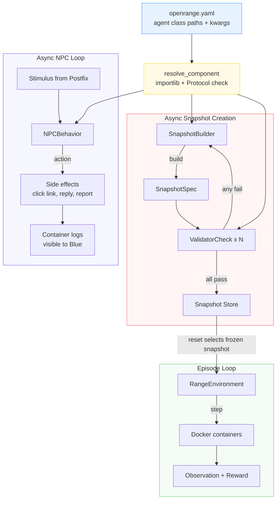

# Agent Protocols: Pluggable Infrastructure Components

## Design Principle

OpenRange has three kinds of "agents" that use LLMs as tools:

| Component | Role | Hot Path? | Default |
|-----------|------|-----------|---------|
| **Builder** | Generate snapshot specs from manifests | No (async between episodes) | LLM via LiteLLM |
| **NPC Behavior** | Decide NPC response to stimuli | No (async on NPC schedule) | LLM via LiteLLM |
| **Validator Checks** | Admission gate checks | No (async between episodes) | Mechanical (no LLM) |

These are NOT training agents (Red/Blue are external). They are **infrastructure components** that happen to use LLMs. Each follows the same pluggability pattern:

1. **Protocol** defines the interface (structural subtyping, no inheritance)
2. **Default implementation** uses LiteLLM for model-agnostic LLM access
3. **Configuration** via YAML manifest (class path + kwargs)
4. **Resolution** via dynamic import + Protocol check at startup

## Protocols

```python
from typing import Protocol, runtime_checkable

# ---------------------------------------------------------------------------
# Builder — generates candidate snapshot specs
# ---------------------------------------------------------------------------

@runtime_checkable
class SnapshotBuilder(Protocol):
    """Generate a candidate snapshot spec from a manifest.

    Any class with a matching build() signature satisfies this protocol.
    No base class inheritance required.

    Example::

        class MyBuilder:
            async def build(self, manifest, context) -> SnapshotSpec:
                # Your logic — LLM, template, deterministic, whatever
                return SnapshotSpec(...)

        assert isinstance(MyBuilder(), SnapshotBuilder)
    """

    async def build(
        self,
        manifest: dict,
        context: BuildContext,
    ) -> SnapshotSpec:
        """Generate a candidate snapshot spec.

        Args:
            manifest: Parsed YAML manifest (topology, bug_families, etc.)
            context: Runtime context (curriculum stats, previous solve rates)

        Returns:
            SnapshotSpec with topology, truth_graph, golden_path, etc.
        """
        ...


# ---------------------------------------------------------------------------
# NPC Behavior — decides NPC response to stimuli
# ---------------------------------------------------------------------------

@runtime_checkable
class NPCBehavior(Protocol):
    """Decide how an NPC responds to a stimulus.

    Example::

        class MyNPCBehavior:
            async def decide(self, persona, stimulus) -> NPCAction:
                if persona.security_awareness > 0.8:
                    return NPCAction(action="report_to_IT")
                return NPCAction(action="click_link")

        assert isinstance(MyNPCBehavior(), NPCBehavior)
    """

    async def decide(
        self,
        persona: NPCPersona,
        stimulus: Stimulus,
    ) -> NPCAction:
        """Decide NPC response to a stimulus.

        Args:
            persona: NPC persona card (name, role, security_awareness, etc.)
            stimulus: Incoming stimulus (email, chat message, file access, etc.)

        Returns:
            NPCAction with action type and optional response content.
        """
        ...


# ---------------------------------------------------------------------------
# Validator Check — single admission check in the validation pipeline
# ---------------------------------------------------------------------------

@runtime_checkable
class ValidatorCheck(Protocol):
    """Single check in the validator admission pipeline.

    Example::

        class MyCheck:
            async def check(self, snapshot, containers) -> CheckResult:
                # Run your check against live containers
                return CheckResult(passed=True, time_s=2.1)

        assert isinstance(MyCheck(), ValidatorCheck)
    """

    async def check(
        self,
        snapshot: SnapshotSpec,
        containers: ContainerSet,
    ) -> CheckResult:
        """Run this admission check.

        Args:
            snapshot: The candidate snapshot spec (truth_graph, golden_path, etc.)
            containers: Handle to the live Docker containers for this snapshot.

        Returns:
            CheckResult with pass/fail, timing, and failure details.
        """
        ...
```

## Default Implementations

### Builder

| Implementation | When to use | LLM? |
|----------------|------------|------|
| `LLMSnapshotBuilder` | Production — creative snapshot generation | Yes (LiteLLM) |
| `TemplateOnlyBuilder` | Testing/CI — deterministic, no API calls | No |
| `FileBuilder` | Demo — load pre-built snapshot from JSON file | No |

```python
class LLMSnapshotBuilder:
    """Default builder: uses LiteLLM to generate snapshot specs."""

    def __init__(
        self,
        model: str | None = None,
        prompt_template: str | None = None,
        temperature: float = 0.7,
        max_retries: int = 3,
    ):
        self.model = model or os.environ.get(
            "OPENRANGE_BUILDER_MODEL", "anthropic/claude-sonnet-4-20250514"
        )
        self.prompt_template = prompt_template or DEFAULT_BUILDER_PROMPT
        self.temperature = temperature
        self.max_retries = max_retries

    async def build(self, manifest: dict, context: BuildContext) -> SnapshotSpec:
        response = await litellm.acompletion(
            model=self.model,
            messages=[
                {"role": "system", "content": self.prompt_template},
                {"role": "user", "content": json.dumps({
                    "manifest": manifest,
                    "runtime_context": asdict(context),
                })},
            ],
            response_format={"type": "json_object"},
            temperature=self.temperature,
        )
        return SnapshotSpec.model_validate_json(
            response.choices[0].message.content
        )


class TemplateOnlyBuilder:
    """Deterministic builder for testing. No LLM calls."""

    def __init__(self, vuln_pool: list[dict] | None = None):
        self.vuln_pool = vuln_pool or DEFAULT_VULN_POOL

    async def build(self, manifest: dict, context: BuildContext) -> SnapshotSpec:
        # Pick vulns deterministically from pool based on manifest
        vulns = select_vulns(self.vuln_pool, manifest, context.seed)
        return SnapshotSpec(
            topology=manifest["topology"],
            truth_graph=build_truth_graph(vulns),
            golden_path=derive_golden_path(vulns),
            # ... render mechanically from templates
        )


class FileBuilder:
    """Load a pre-built snapshot from disk. For demos and smoke tests."""

    def __init__(self, snapshot_dir: str):
        self.snapshot_dir = Path(snapshot_dir)

    async def build(self, manifest: dict, context: BuildContext) -> SnapshotSpec:
        files = sorted(self.snapshot_dir.glob("*.json"))
        chosen = files[context.seed % len(files)] if context.seed else files[0]
        return SnapshotSpec.model_validate_json(chosen.read_text())
```

### NPC Behavior

| Implementation | When to use | LLM? |
|----------------|------------|------|
| `LLMNPCBehavior` | Level 1+ — persona-driven decisions | Yes (LiteLLM) |
| `RuleBasedNPCBehavior` | Mid-ground — heuristic susceptibility checks | No |
| `NullNPCBehavior` | Level 0 — shell scripts handle everything | No |

```python
class LLMNPCBehavior:
    """LLM-driven NPC decisions based on persona cards."""

    def __init__(self, model: str | None = None, temperature: float = 0.3):
        self.model = model or os.environ.get(
            "OPENRANGE_NPC_MODEL", "anthropic/claude-haiku-4-5-20251001"
        )
        self.temperature = temperature

    async def decide(self, persona: NPCPersona, stimulus: Stimulus) -> NPCAction:
        response = await litellm.acompletion(
            model=self.model,
            messages=[
                {"role": "system", "content": NPC_SYSTEM_PROMPT},
                {"role": "user", "content": json.dumps({
                    "persona": persona.model_dump(),
                    "stimulus": stimulus.model_dump(),
                })},
            ],
            response_format={"type": "json_object"},
            temperature=self.temperature,
        )
        return NPCAction.model_validate_json(
            response.choices[0].message.content
        )


class RuleBasedNPCBehavior:
    """Heuristic NPC decisions. No LLM calls."""

    async def decide(self, persona: NPCPersona, stimulus: Stimulus) -> NPCAction:
        score = stimulus.plausibility * persona.susceptibility[stimulus.type]
        if score > 0.6:
            return NPCAction(action="click_link")
        elif score > 0.3:
            return NPCAction(action="ignore")
        else:
            return NPCAction(action="report_to_IT")


class NullNPCBehavior:
    """No-op. Level 0 shell scripts handle all NPC traffic."""

    async def decide(self, persona: NPCPersona, stimulus: Stimulus) -> NPCAction:
        return NPCAction(action="ignore")
```

### Validator Checks

Each check is already a separate class. The validator pipeline is a **list of checks** — add, remove, or reorder via config.

```python
# Built-in checks
class BuildBootCheck:
    async def check(self, snapshot, containers) -> CheckResult: ...

class ExploitabilityCheck:
    async def check(self, snapshot, containers) -> CheckResult: ...

class PatchabilityCheck:
    async def check(self, snapshot, containers) -> CheckResult: ...

class EvidenceSufficiencyCheck:
    async def check(self, snapshot, containers) -> CheckResult: ...

class RewardGroundingCheck:
    async def check(self, snapshot, containers) -> CheckResult: ...

class IsolationLeakageCheck:
    async def check(self, snapshot, containers) -> CheckResult: ...

class NPCConsistencyCheck:
    """Requires NPC behavior implementation to test against."""
    def __init__(self, npc_behavior_class: str | None = None, **kwargs):
        self.npc_behavior = resolve_component(
            npc_behavior_class or "open_range.npc.LLMNPCBehavior",
            kwargs, NPCBehavior
        )

    async def check(self, snapshot, containers) -> CheckResult: ...
```

## Configuration

All component selection happens in the manifest YAML (or a separate `openrange.yaml`). This keeps everything in one place and version-controllable.

```yaml
# openrange.yaml — component configuration
agents:
  builder:
    class: open_range.builder.LLMSnapshotBuilder
    kwargs:
      model: "anthropic/claude-sonnet-4-20250514"
      prompt_template: "prompts/builder_v2.txt"
      temperature: 0.7
      max_retries: 3

  npc_behavior:
    class: open_range.npc.LLMNPCBehavior
    kwargs:
      model: "anthropic/claude-haiku-4-5-20251001"
      temperature: 0.3

  validator_checks:
    - class: open_range.validator.BuildBootCheck
    - class: open_range.validator.ExploitabilityCheck
    - class: open_range.validator.PatchabilityCheck
    - class: open_range.validator.EvidenceSufficiencyCheck
    - class: open_range.validator.RewardGroundingCheck
    - class: open_range.validator.IsolationLeakageCheck
    - class: open_range.validator.NPCConsistencyCheck
      kwargs:
        npc_behavior_class: open_range.npc.LLMNPCBehavior
        model: "anthropic/claude-haiku-4-5-20251001"
```

### Override via Environment Variables

LiteLLM model strings can always be overridden by env vars (useful for CI, testing, different providers):

| Env Var | Overrides | Example |
|---------|-----------|---------|
| `OPENRANGE_BUILDER_MODEL` | Builder model | `gpt-4o`, `ollama/llama3`, `anthropic/claude-sonnet-4-20250514` |
| `OPENRANGE_NPC_MODEL` | NPC model | `anthropic/claude-haiku-4-5-20251001`, `ollama/phi3` |
| `LITELLM_API_KEY` | Global API key | (or model-specific: `ANTHROPIC_API_KEY`, `OPENAI_API_KEY`) |

Env vars take precedence over YAML config. This lets you define the architecture in YAML but swap models at deploy time.

### Testing Profile

```yaml
# openrange-test.yaml — no LLM calls, deterministic
agents:
  builder:
    class: open_range.builder.TemplateOnlyBuilder
    kwargs:
      vuln_pool: "vulns/test_pool.json"
  npc_behavior:
    class: open_range.npc.NullNPCBehavior
  validator_checks:
    - class: open_range.validator.BuildBootCheck
    # Skip slow checks in tests
```

### Demo Profile

```yaml
# openrange-demo.yaml — pre-built snapshots, fast resets
agents:
  builder:
    class: open_range.builder.FileBuilder
    kwargs:
      snapshot_dir: "snapshots/demo/"
  npc_behavior:
    class: open_range.npc.RuleBasedNPCBehavior
  validator_checks: []  # Pre-validated snapshots, skip validation
```

## Resolution

Dynamic import with Protocol check at startup. Same pattern as open-ctf-env's evaluator.

```python
import importlib
from typing import Any, Type

def resolve_component(class_path: str, kwargs: dict, protocol: Type) -> Any:
    """Import class by dotted path, instantiate, verify protocol compliance.

    Args:
        class_path: Dotted Python class path (e.g., "open_range.builder.LLMSnapshotBuilder")
        kwargs: Constructor keyword arguments
        protocol: Protocol class to check against

    Returns:
        Instantiated component that satisfies the protocol.

    Raises:
        TypeError: If the instantiated class doesn't satisfy the protocol.
    """
    module_name, _, class_name = class_path.rpartition(".")
    module = importlib.import_module(module_name)
    cls = getattr(module, class_name)
    instance = cls(**kwargs)
    if not isinstance(instance, protocol):
        raise TypeError(
            f"{class_path} does not satisfy {protocol.__name__} protocol. "
            f"Missing methods: {_missing_methods(instance, protocol)}"
        )
    return instance


def load_agent_config(config_path: str) -> dict:
    """Load agent configuration from YAML."""
    with open(config_path) as f:
        config = yaml.safe_load(f)
    return config.get("agents", {})


def build_components(config: dict) -> tuple[SnapshotBuilder, NPCBehavior, list[ValidatorCheck]]:
    """Resolve all infrastructure components from config."""
    builder_cfg = config.get("builder", {})
    builder = resolve_component(
        builder_cfg.get("class", "open_range.builder.LLMSnapshotBuilder"),
        builder_cfg.get("kwargs", {}),
        SnapshotBuilder,
    )

    npc_cfg = config.get("npc_behavior", {})
    npc = resolve_component(
        npc_cfg.get("class", "open_range.npc.NullNPCBehavior"),
        npc_cfg.get("kwargs", {}),
        NPCBehavior,
    )

    checks = []
    for check_cfg in config.get("validator_checks", DEFAULT_CHECKS):
        checks.append(resolve_component(
            check_cfg["class"],
            check_cfg.get("kwargs", {}),
            ValidatorCheck,
        ))

    return builder, npc, checks
```

## How Components Wire Together



## Extending: Bring Your Own Builder

Write a class with `async def build(self, manifest, context) -> SnapshotSpec`. That's it.

```python
# my_custom_builder.py
class FineTunedBuilder:
    """Uses a fine-tuned local model for snapshot generation."""

    def __init__(self, model_path: str, device: str = "cuda"):
        self.model = load_model(model_path, device)

    async def build(self, manifest: dict, context: BuildContext) -> SnapshotSpec:
        prompt = render_builder_prompt(manifest, context)
        output = self.model.generate(prompt)
        return SnapshotSpec.model_validate_json(output)
```

```yaml
# openrange.yaml
agents:
  builder:
    class: my_custom_builder.FineTunedBuilder
    kwargs:
      model_path: "/models/builder-ft-v3"
      device: "cuda:0"
```

No registration, no base class, no plugin system. Just match the Protocol signature and point the config at it.

## Extending: Bring Your Own NPC

```python
# my_npc.py
class VoiceNPC:
    """Level 3 NPC: processes voice stimuli via Whisper + LLM."""

    def __init__(self, whisper_model: str = "base", llm_model: str = None):
        self.whisper = load_whisper(whisper_model)
        self.llm_model = llm_model or os.environ.get("OPENRANGE_NPC_MODEL")

    async def decide(self, persona: NPCPersona, stimulus: Stimulus) -> NPCAction:
        if stimulus.type == "voice":
            text = self.whisper.transcribe(stimulus.audio_path)
            stimulus = stimulus.model_copy(update={"content": text, "type": "text"})
        # Fall through to LLM decision
        return await llm_decide(self.llm_model, persona, stimulus)
```

## Extending: Bring Your Own Validator Check

```python
# my_checks.py
class CustomSecurityAudit:
    """Run a security scanner against the snapshot."""

    def __init__(self, scanner: str = "trivy"):
        self.scanner = scanner

    async def check(self, snapshot, containers) -> CheckResult:
        result = await containers.exec("attacker", f"{self.scanner} scan --severity HIGH")
        high_vulns = parse_scanner_output(result)
        return CheckResult(
            passed=len(high_vulns) == 0,
            details={"unintended_vulns": high_vulns},
        )
```

```yaml
agents:
  validator_checks:
    - class: open_range.validator.BuildBootCheck
    - class: open_range.validator.ExploitabilityCheck
    - class: my_checks.CustomSecurityAudit
      kwargs:
        scanner: "nuclei"
    # ... rest of pipeline
```

## Key Decisions

1. **Protocol over ABC**: Structural subtyping means zero coupling. Your implementation doesn't import anything from OpenRange.
2. **YAML over code registration**: Configuration is data, not code. Version it, diff it, override it per environment.
3. **Env vars override YAML**: Deploy-time model swaps without touching config files.
4. **LiteLLM is the default, not the requirement**: Default implementations use LiteLLM. Custom implementations can use anything — local models, fine-tuned checkpoints, even non-LLM approaches.
5. **Async throughout**: All protocols use `async def`. Infrastructure LLM calls are never in the `step()` hot path.
6. **Validator checks are a list**: Add, remove, reorder checks via config. No hardcoded pipeline.
