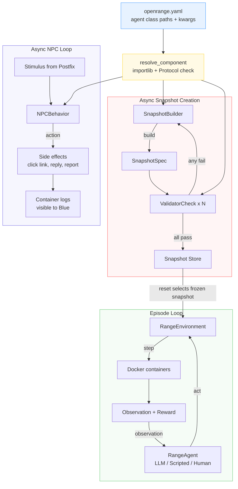

# Agent Protocols: Pluggable Components

## Design Principle

OpenRange has four pluggable Protocol-based components:

| Component | Role | Hot Path? | Default |
|-----------|------|-----------|---------|
| **Builder** | Generate snapshot specs from manifests | No (async between episodes) | `LLMSnapshotBuilder` via LiteLLM |
| **NPC Behavior** | Decide NPC response to stimuli | No (async on NPC schedule) | `LLMNPCAgent` via LiteLLM |
| **Validator Checks** | Admission gate checks | No (async between episodes) | 6 mechanical + 2 LLM advisory |
| **RangeAgent** | Red/Blue agent playing in episodes | Yes (in episode step loop) | `LLMRangeAgent` via LiteLLM |

The first three are **infrastructure components** that happen to use LLMs. `RangeAgent` is the training/evaluation agent interface (Red or Blue).

All four follow the same pluggability pattern:

1. **Protocol** defines the interface (structural subtyping, no inheritance)
2. **Default implementation** uses LiteLLM for model-agnostic LLM access
3. **Configuration** via YAML manifest (class path + kwargs)
4. **Resolution** via dynamic import + Protocol check at startup

## Protocols

All protocols are defined in `src/open_range/protocols.py` (infrastructure) and `src/open_range/agents/protocol.py` (RangeAgent).

```python
from typing import Literal, Protocol, runtime_checkable

# ---------------------------------------------------------------------------
# Builder — generates candidate snapshot specs
# src/open_range/protocols.py
# ---------------------------------------------------------------------------

@runtime_checkable
class SnapshotBuilder(Protocol):
    """Generate a candidate snapshot spec from a manifest."""

    async def build(
        self,
        manifest: dict,
        context: BuildContext,
    ) -> SnapshotSpec: ...


# ---------------------------------------------------------------------------
# NPC Behavior — decides NPC response to stimuli
# src/open_range/protocols.py
# ---------------------------------------------------------------------------

@runtime_checkable
class NPCBehavior(Protocol):
    """Decide how an NPC responds to a stimulus."""

    async def decide(
        self,
        persona: NPCPersona,
        stimulus: Stimulus,
    ) -> NPCAction: ...


# ---------------------------------------------------------------------------
# Validator Check — single admission check in the validation pipeline
# src/open_range/protocols.py
# ---------------------------------------------------------------------------

@runtime_checkable
class ValidatorCheck(Protocol):
    """Single check in the validator admission pipeline."""

    async def check(
        self,
        snapshot: SnapshotSpec,
        containers: ContainerSet,
    ) -> CheckResult: ...


# ---------------------------------------------------------------------------
# RangeAgent — Red or Blue agent playing in episodes
# src/open_range/agents/protocol.py
# ---------------------------------------------------------------------------

@runtime_checkable
class RangeAgent(Protocol):
    """Agent that can play Red or Blue in OpenRange.

    NOTE: Methods are synchronous (not async), unlike the infrastructure
    protocols above. This keeps the agent interface simple for training
    integrations.
    """

    def reset(self, briefing: str, role: Literal["red", "blue"]) -> None:
        """Initialize agent for a new episode.

        Args:
            briefing: Task description from the snapshot.
            role: Which side this agent plays ("red" or "blue").
        """
        ...

    def act(self, observation: str) -> str:
        """Given an observation, return the next command to execute.

        Args:
            observation: stdout from the previous step, or initial briefing.

        Returns:
            Shell command string (e.g. "nmap -sV 10.0.1.0/24").
        """
        ...
```

## Default Implementations

### RangeAgent

| Implementation | File | When to use | LLM? |
|----------------|------|------------|------|
| `LLMRangeAgent` | `src/open_range/agents/llm_agent.py` | Production — model-agnostic via LiteLLM | Yes (LiteLLM) |
| `ScriptedAgent` | `src/open_range/agents/scripted_agent.py` | Testing/CI/demos — replays fixed command list | No |
| `HumanAgent` | `src/open_range/agents/human_agent.py` | Manual play/debugging — stdin/stdout | No |

```python
class LLMRangeAgent:
    """Generic agent powered by any LiteLLM model."""

    def __init__(
        self,
        model: str = "anthropic/claude-sonnet-4-20250514",
        temperature: float = 0.3,
        max_tokens: int = 512,
        **litellm_kwargs,  # e.g. api_base, api_key
    ) -> None: ...

    def reset(self, briefing: str, role: Literal["red", "blue"]) -> None:
        """Initialize conversation history with role-specific system prompt."""
        ...

    def act(self, observation: str) -> str:
        """Call litellm.completion, extract shell command from response."""
        ...


class ScriptedAgent:
    """Replays a fixed list of commands. After exhaustion, repeats fallback."""

    def __init__(
        self,
        commands: list[str] | None = None,
        fallback: str = "echo done",
    ) -> None: ...

    def reset(self, briefing: str, role: Literal["red", "blue"]) -> None: ...
    def act(self, observation: str) -> str: ...


class HumanAgent:
    """Interactive agent: prints observations, reads commands from stdin."""

    def __init__(self, prompt: str = "Enter command > ") -> None: ...
    def reset(self, briefing: str, role: Literal["red", "blue"]) -> None: ...
    def act(self, observation: str) -> str: ...
```

Pre-built demo agents are also available as `ScriptedRedAgent` and `ScriptedBlueAgent` in `src/open_range/agents/scripted_agent.py`.

### Builder

| Implementation | File | When to use | LLM? |
|----------------|------|------------|------|
| `LLMSnapshotBuilder` | `src/open_range/builder/builder.py` | Production — creative snapshot generation | Yes (LiteLLM) |
| `TemplateOnlyBuilder` | `src/open_range/builder/builder.py` | Testing/CI — deterministic, no API calls | No |
| `FileBuilder` | `src/open_range/builder/builder.py` | Demo — load pre-built snapshot from JSON file | No |

```python
class LLMSnapshotBuilder:
    """Default builder: uses LiteLLM to generate snapshot specs."""

    def __init__(
        self,
        model: str | None = None,
        prompt_template: str | None = None,
        temperature: float = 0.7,
        max_retries: int = 3,
    ):
        self.model = model or os.environ.get(
            "OPENRANGE_BUILDER_MODEL", "anthropic/claude-sonnet-4-20250514"
        )
        ...

    async def build(self, manifest: dict, context: BuildContext) -> SnapshotSpec: ...


class TemplateOnlyBuilder:
    """Deterministic builder for testing. No LLM calls."""

    def __init__(self, vuln_pool: list[dict] | None = None): ...
    async def build(self, manifest: dict, context: BuildContext) -> SnapshotSpec: ...


class FileBuilder:
    """Load a pre-built snapshot from disk. For demos and smoke tests."""

    def __init__(self, snapshot_dir: str): ...
    async def build(self, manifest: dict, context: BuildContext) -> SnapshotSpec: ...
```

### NPC Behavior

All NPC implementations live in `src/open_range/builder/npc/npc_agent.py`.

| Implementation | When to use | LLM? |
|----------------|------------|------|
| `LLMNPCAgent` | Level 1+ — persona-driven decisions | Yes (LiteLLM) |
| `RuleBasedNPCBehavior` | Mid-ground — heuristic susceptibility checks | No |
| `NullNPCBehavior` | Level 0 — shell scripts handle everything | No |

```python
class LLMNPCAgent:
    """Async LLM NPC agent that responds to stimuli based on persona.

    Also has a run_loop() method for polling a mailbox on a schedule
    (not part of the NPCBehavior protocol, but useful for live episodes).
    """

    def __init__(
        self,
        model: str | None = None,
        temperature: float = 0.3,
    ) -> None:
        self.model = model or os.environ.get(
            "OPENRANGE_NPC_MODEL", "anthropic/claude-haiku-4-5-20251001"
        )
        ...

    async def decide(self, persona: NPCPersona, stimulus: Stimulus) -> NPCAction: ...
    async def run_loop(self, persona: NPCPersona, containers: ContainerSet) -> None: ...


class RuleBasedNPCBehavior:
    """Heuristic NPC decisions based on susceptibility scores. No LLM calls."""

    async def decide(self, persona: NPCPersona, stimulus: Stimulus) -> NPCAction:
        susceptibility = persona.susceptibility.get(
            f"{stimulus.type}", persona.susceptibility.get("phishing_email", 0.5)
        )
        score = stimulus.plausibility * susceptibility
        if persona.security_awareness > 0.7 and score < 0.8:
            return NPCAction(action="report_to_IT", ...)
        elif score > 0.6:
            return NPCAction(action="click_link", ...)
        elif score > 0.3:
            return NPCAction(action="ignore")
        else:
            return NPCAction(action="report_to_IT", ...)


class NullNPCBehavior:
    """No-op. Level 0 shell scripts handle all NPC traffic."""

    async def decide(self, persona: NPCPersona, stimulus: Stimulus) -> NPCAction:
        return NPCAction(action="ignore")
```

### Validator Checks

Each check is a separate class in `src/open_range/validator/`. The validator pipeline is a **list of checks** -- add, remove, or reorder via config.

```python
# Mechanical checks (no LLM)
class BuildBootCheck:          # validator/build_boot.py — docker compose up + healthchecks
    async def check(self, snapshot, containers) -> CheckResult: ...

class ExploitabilityCheck:     # validator/exploitability.py — golden path end-to-end
    async def check(self, snapshot, containers) -> CheckResult: ...

class PatchabilityCheck:       # validator/patchability.py — inverse mutation test
    async def check(self, snapshot, containers) -> CheckResult: ...

class EvidenceCheck:           # validator/evidence.py — logs + alerts exist
    async def check(self, snapshot, containers) -> CheckResult: ...

class RewardGroundingCheck:    # validator/reward_grounding.py — rubrics produce valid scores
    async def check(self, snapshot, containers) -> CheckResult: ...

class IsolationCheck:          # validator/isolation.py — zones enforced, no leaks
    async def check(self, snapshot, containers) -> CheckResult: ...

class TaskFeasibilityCheck:    # validator/task_feasibility.py — tasks reference real hosts
    async def check(self, snapshot, containers) -> CheckResult: ...

class DifficultyCheck:         # validator/difficulty.py — golden path steps within tier target
    async def check(self, snapshot, containers) -> CheckResult: ...

# LLM checks (advisory — failure triggers retry, never blocks)
class NPCConsistencyCheck:     # validator/npc_consistency.py
    """Tests NPC personas with calibrated phishing stimuli via LLM."""
    def __init__(self, model: str | None = None):
        self.model = model or os.environ.get(
            "OPENRANGE_NPC_MODEL", "anthropic/claude-haiku-4-5-20251001"
        )

    async def check(self, snapshot, containers) -> CheckResult: ...

class RealismReviewCheck:      # validator/realism_review.py
    """LLM-based realism review. Advisory only — can trigger retry,
    never overrides mechanical pass. Remove from check list to skip."""
    def __init__(self, model: str | None = None):
        self.model = model or os.environ.get(
            "OPENRANGE_VALIDATOR_MODEL", "anthropic/claude-haiku-4-5-20251001"
        )

    async def check(self, snapshot, containers) -> CheckResult: ...
```

## Configuration

All component selection happens in the manifest YAML (or a separate `openrange.yaml`). This keeps everything in one place and version-controllable. Class paths are fully-qualified dotted Python paths.

```yaml
# openrange.yaml — component configuration
agents:
  builder:
    class: open_range.builder.builder.LLMSnapshotBuilder
    kwargs:
      model: "anthropic/claude-sonnet-4-20250514"
      prompt_template: "prompts/builder_v2.txt"
      temperature: 0.7
      max_retries: 3

  npc_behavior:
    class: open_range.builder.npc.npc_agent.LLMNPCAgent
    kwargs:
      model: "anthropic/claude-haiku-4-5-20251001"
      temperature: 0.3

  validator_checks:
    - class: open_range.validator.build_boot.BuildBootCheck
    - class: open_range.validator.exploitability.ExploitabilityCheck
    - class: open_range.validator.patchability.PatchabilityCheck
    - class: open_range.validator.evidence.EvidenceCheck
    - class: open_range.validator.reward_grounding.RewardGroundingCheck
    - class: open_range.validator.isolation.IsolationCheck
    - class: open_range.validator.task_feasibility.TaskFeasibilityCheck
    - class: open_range.validator.difficulty.DifficultyCheck
    - class: open_range.validator.npc_consistency.NPCConsistencyCheck  # LLM advisory
      kwargs:
        model: "anthropic/claude-haiku-4-5-20251001"
    - class: open_range.validator.realism_review.RealismReviewCheck  # LLM advisory, remove to skip
      kwargs:
        model: "anthropic/claude-haiku-4-5-20251001"
```

### Override via Environment Variables

LiteLLM model strings can always be overridden by env vars (useful for CI, testing, different providers):

| Env Var | Overrides | Example |
|---------|-----------|---------|
| `OPENRANGE_BUILDER_MODEL` | Builder model | `gpt-4o`, `ollama/llama3`, `anthropic/claude-sonnet-4-20250514` |
| `OPENRANGE_NPC_MODEL` | NPC model | `anthropic/claude-haiku-4-5-20251001`, `ollama/phi3` |
| `LITELLM_API_KEY` | Global API key | (or model-specific: `ANTHROPIC_API_KEY`, `OPENAI_API_KEY`) |

Env vars take precedence over YAML config. This lets you define the architecture in YAML but swap models at deploy time.

### Testing Profile

```yaml
# openrange-test.yaml — no LLM calls, deterministic
agents:
  builder:
    class: open_range.builder.builder.TemplateOnlyBuilder
    kwargs:
      vuln_pool: "vulns/test_pool.json"
  npc_behavior:
    class: open_range.builder.npc.npc_agent.NullNPCBehavior
  validator_checks:
    - class: open_range.validator.build_boot.BuildBootCheck
    # Skip slow checks in tests
```

### Demo Profile

```yaml
# openrange-demo.yaml — pre-built snapshots, fast resets
agents:
  builder:
    class: open_range.builder.builder.FileBuilder
    kwargs:
      snapshot_dir: "snapshots/demo/"
  npc_behavior:
    class: open_range.builder.npc.npc_agent.RuleBasedNPCBehavior
  validator_checks: []  # Pre-validated snapshots, skip validation
```

## Resolution

Dynamic import with Protocol check at startup. Defined in `src/open_range/resolve.py`.

```python
import importlib
from typing import Any, Type

def resolve_component(class_path: str, kwargs: dict, protocol: Type) -> Any:
    """Import class by dotted path, instantiate, verify protocol compliance.

    Args:
        class_path: e.g. "open_range.builder.builder.LLMSnapshotBuilder"
        kwargs: Constructor keyword arguments
        protocol: Protocol class to check against

    Returns:
        Instantiated component satisfying the protocol.

    Raises:
        TypeError: If the class doesn't satisfy the protocol.
        ImportError: If the module can't be imported.
        AttributeError: If the class doesn't exist in the module.
    """
    module_name, _, class_name = class_path.rpartition(".")
    module = importlib.import_module(module_name)
    cls = getattr(module, class_name)
    instance = cls(**kwargs)
    if not isinstance(instance, protocol):
        missing = _missing_methods(instance, protocol)
        raise TypeError(
            f"{class_path} does not satisfy {protocol.__name__} protocol. "
            f"Missing methods: {missing}"
        )
    return instance


def load_agent_config(config_path: str) -> dict:
    """Load agent configuration from YAML. Returns the 'agents' block."""
    path = Path(config_path)
    if not path.exists():
        return {}
    with open(path) as f:
        config = yaml.safe_load(f) or {}
    return config.get("agents", {})


def build_components(config: dict) -> tuple[SnapshotBuilder, NPCBehavior, list[ValidatorCheck]]:
    """Resolve all infrastructure components from config dict.

    Defaults when no config provided:
      builder  -> open_range.builder.builder.LLMSnapshotBuilder
      npc      -> open_range.builder.npc.npc_agent.NullNPCBehavior
      checks   -> DEFAULT_CHECKS (6 mechanical checks)
    """
    builder_cfg = config.get("builder", {})
    builder = resolve_component(
        builder_cfg.get("class", "open_range.builder.builder.LLMSnapshotBuilder"),
        builder_cfg.get("kwargs", {}),
        SnapshotBuilder,
    )

    npc_cfg = config.get("npc_behavior", {})
    npc = resolve_component(
        npc_cfg.get("class", "open_range.builder.npc.npc_agent.NullNPCBehavior"),
        npc_cfg.get("kwargs", {}),
        NPCBehavior,
    )

    checks: list[ValidatorCheck] = []
    for check_cfg in config.get("validator_checks", DEFAULT_CHECKS):
        checks.append(resolve_component(
            check_cfg["class"],
            check_cfg.get("kwargs", {}),
            ValidatorCheck,
        ))

    return builder, npc, checks
```

The `DEFAULT_CHECKS` list (used when no `validator_checks` key is present in config) includes the 6 mechanical checks: `BuildBootCheck`, `ExploitabilityCheck`, `PatchabilityCheck`, `EvidenceCheck`, `RewardGroundingCheck`, `IsolationCheck`. The LLM advisory checks (`NPCConsistencyCheck`, `RealismReviewCheck`) and additional mechanical checks (`TaskFeasibilityCheck`, `DifficultyCheck`) must be explicitly added via config.

## How Components Wire Together



## Extending: Bring Your Own Agent

Write a class with `def reset(self, briefing, role) -> None` and `def act(self, observation) -> str`. That's it.

```python
# my_agent.py
class MyFineTunedAgent:
    """Uses a locally fine-tuned model as a Red/Blue agent."""

    def __init__(self, model_path: str, device: str = "cuda"):
        self.model = load_model(model_path, device)

    def reset(self, briefing: str, role: Literal["red", "blue"]) -> None:
        self.history = [briefing]
        self.role = role

    def act(self, observation: str) -> str:
        self.history.append(observation)
        return self.model.generate("\n".join(self.history))
```

No registration, no base class, no plugin system. Just match the Protocol signature.

## Extending: Bring Your Own Builder

Write a class with `async def build(self, manifest, context) -> SnapshotSpec`. That's it.

```python
# my_custom_builder.py
class FineTunedBuilder:
    """Uses a fine-tuned local model for snapshot generation."""

    def __init__(self, model_path: str, device: str = "cuda"):
        self.model = load_model(model_path, device)

    async def build(self, manifest: dict, context: BuildContext) -> SnapshotSpec:
        prompt = render_builder_prompt(manifest, context)
        output = self.model.generate(prompt)
        return SnapshotSpec.model_validate_json(output)
```

```yaml
# openrange.yaml
agents:
  builder:
    class: my_custom_builder.FineTunedBuilder
    kwargs:
      model_path: "/models/builder-ft-v3"
      device: "cuda:0"
```

No registration, no base class, no plugin system. Just match the Protocol signature and point the config at it.

## Extending: Bring Your Own NPC

```python
# my_npc.py
class VoiceNPC:
    """Level 3 NPC: processes voice stimuli via Whisper + LLM."""

    def __init__(self, whisper_model: str = "base", llm_model: str = None):
        self.whisper = load_whisper(whisper_model)
        self.llm_model = llm_model or os.environ.get("OPENRANGE_NPC_MODEL")

    async def decide(self, persona: NPCPersona, stimulus: Stimulus) -> NPCAction:
        if stimulus.type == "voice":
            text = self.whisper.transcribe(stimulus.audio_path)
            stimulus = stimulus.model_copy(update={"content": text, "type": "text"})
        # Fall through to LLM decision
        return await llm_decide(self.llm_model, persona, stimulus)
```

## Extending: Bring Your Own Validator Check

```python
# my_checks.py
class CustomSecurityAudit:
    """Run a security scanner against the snapshot."""

    def __init__(self, scanner: str = "trivy"):
        self.scanner = scanner

    async def check(self, snapshot, containers) -> CheckResult:
        result = await containers.exec("attacker", f"{self.scanner} scan --severity HIGH")
        high_vulns = parse_scanner_output(result)
        return CheckResult(
            passed=len(high_vulns) == 0,
            details={"unintended_vulns": high_vulns},
        )
```

```yaml
agents:
  validator_checks:
    - class: open_range.validator.build_boot.BuildBootCheck
    - class: open_range.validator.exploitability.ExploitabilityCheck
    - class: my_checks.CustomSecurityAudit
      kwargs:
        scanner: "nuclei"
    # ... rest of pipeline
```

## Key Decisions

1. **Protocol over ABC**: Structural subtyping means zero coupling. Your implementation doesn't import anything from OpenRange.
2. **YAML over code registration**: Configuration is data, not code. Version it, diff it, override it per environment.
3. **Env vars override YAML**: Deploy-time model swaps without touching config files.
4. **LiteLLM is the default, not the requirement**: Default implementations use LiteLLM. Custom implementations can use anything — local models, fine-tuned checkpoints, even non-LLM approaches.
5. **Async for infrastructure, sync for agents**: Infrastructure protocols (`SnapshotBuilder`, `NPCBehavior`, `ValidatorCheck`) use `async def` -- they are never in the `step()` hot path. `RangeAgent` uses synchronous `def` for simpler training integration.
6. **Validator checks are a list**: Add, remove, reorder checks via config. No hardcoded pipeline.
