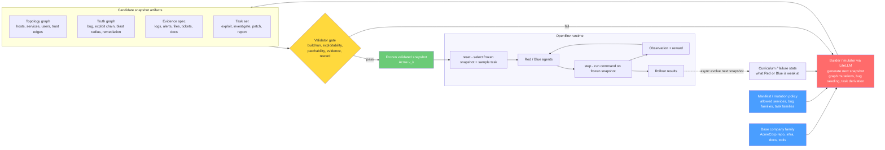
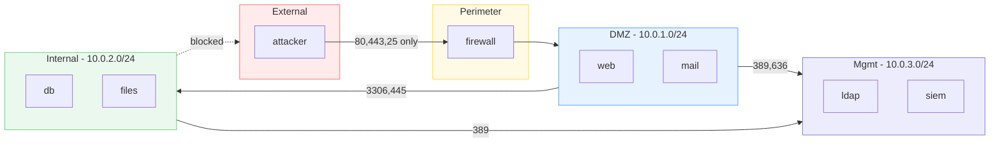
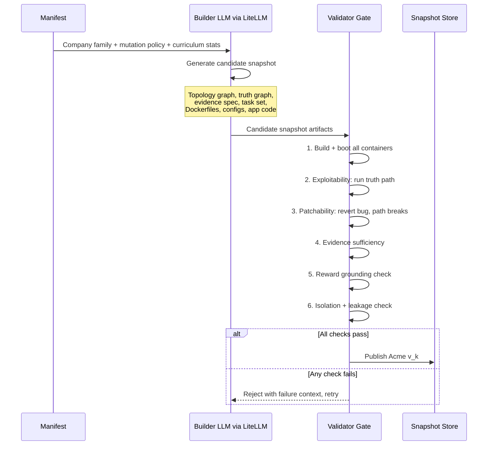
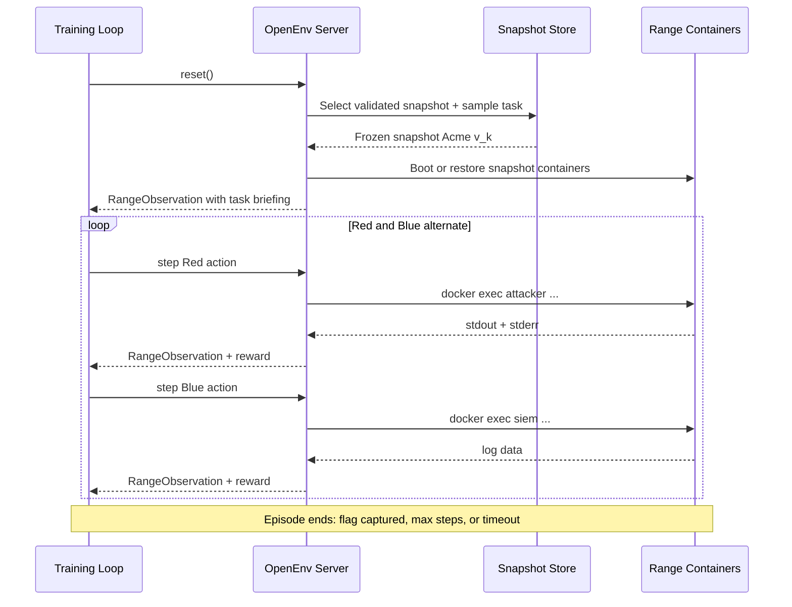

# Architecture

## System Overview

OpenRange uses a **snapshot-based architecture**. A manifest defines a legal family of company worlds. A builder/mutator (LLM-driven via LiteLLM) proposes candidate snapshots inside that family. A validator gate (purely mechanical) admits only snapshots that boot, remain coherent, and are actually solvable. `reset()` selects a frozen validated snapshot for the next episode. Mutation happens asynchronously between episodes.



## Key Principle

**LLM generates, rules validate.** The builder/mutator uses LiteLLM (any model -- Claude, GPT-4o, open models) to generate snapshots creatively. The validator gate is purely mechanical: executable checks, no LLM judgment. Rewards are grounded in container state, never LLM-evaluated.

## Infrastructure

**Everything runs in Docker Compose.** The OpenEnv server is a container in the same compose stack as the range. It communicates with range containers via the Docker SDK (mounted `/var/run/docker.sock`).

### Tier 1 Containers (8 total)

| Container | Zone | Services | Role |
|-----------|------|----------|------|
| `attacker` | external | kali tools, nmap, sqlmap, hydra | Red agent's execution environment |
| `firewall` | perimeter | iptables, NAT, port forwarding, IDS rules | Network segmentation between zones |
| `web` | DMZ | nginx, PHP/Python app, sshd | Public-facing web application |
| `mail` | DMZ | postfix SMTP, dovecot IMAP | Email server with user mailboxes |
| `db` | internal | MySQL/PostgreSQL, app schemas, flag data | Database backend for web + mail |
| `files` | internal | samba, SMB shares, sensitive documents | File server with access controls |
| `ldap` | management | OpenLDAP, Kerberos, user directory | Authentication and authorization for all services |
| `siem` | management | rsyslog, log aggregation, alert rules | Blue agent's entry point, receives all logs |

### Network Zones



### Service Interconnections

Every service is real and talks to other services:

- **web** authenticates users against **ldap**, queries **db** for app data, logs to **siem**
- **mail** does user lookup against **ldap**, stores mailboxes locally, logs to **siem**
- **files** authorizes SMB access via **ldap**, logs to **siem**
- **db** accepts connections from **web** and **files**, logs queries to **siem**
- **ldap** provides auth for all services, replicates to **siem** for audit
- **siem** aggregates logs from all hosts -- Blue agent reads these
- **firewall** enforces zone boundaries, logs blocked/allowed traffic to **siem**
- **attacker** has no access to anything except through the **firewall**

## Data Flow

### Snapshot Creation (asynchronous, between episodes)



### Episode Loop (synchronous, standard OpenEnv)



### Curriculum (post-hackathon)

1. Track Red solve rate and Blue detection rate per snapshot
2. Feed failure stats back to builder for next mutation
3. Builder LLM adjusts difficulty via `r_inject = 1 - (1+alpha)*s`
4. When agents plateau: horizontal growth (add containers, zones, services)

## Snapshot Artifacts

Each validated snapshot contains:

| Artifact | What it is | Example |
|----------|-----------|---------|
| **Topology graph** | Hosts, services, users, network zones, trust edges | 8 containers, 4 zones, 12 users, firewall rules |
| **Truth graph** | Bug location, exploit chain, blast radius, remediation steps | SQLi in web/search.php, chain to DB creds, fix: parameterize |
| **Evidence spec** | Logs, alerts, files, tickets that Blue can investigate | web access logs show injection patterns, SIEM alert rule fires |
| **Task set** | What Red and Blue are asked to do | Red: find and exploit vulns. Blue: detect, investigate, patch |
| **Docker artifacts** | Compose file, Dockerfiles, configs, app code, flag files | docker-compose.yml, nginx.conf, init.sql, app.php |
| **Golden path** | Step-by-step exploit chain with expected outputs | nmap, curl, sqlmap, pivot, submit_flag |
| **NPC traffic config** | Background traffic rates per service | HTTP: 30/min, SMTP: 5/min, LDAP: 10/min |

## Reward Architecture

All rewards implemented as OpenEnv `Rubric` subclasses:

```
CompositeRedReward (WeightedSum)
  ├── FlagReward          binary, docker exec verified
  ├── EfficiencyReward    gamma^steps
  ├── StealthReward       coupled to Blue detection history
  ├── EvidenceReward      quality of submit_evidence
  └── HallucinationPenalty  -0.3 per fake flag

CompositeBlueReward (WeightedSum)
  ├── DetectionReward     TP rate vs Red action log
  ├── PatchReward         binary, golden path re-execution
  ├── AvailabilityReward  healthcheck fraction
  └── FalsePositiveReward -0.2 per NPC traffic flagged
```

Rewards are computed from **container state and action logs**, never from LLM judgment.

## LLM Integration via LiteLLM

Builder uses LiteLLM for model-agnostic snapshot generation:

```python
import litellm

response = litellm.completion(
    model=os.environ.get("OPENRANGE_BUILDER_MODEL", "anthropic/claude-sonnet-4-20250514"),
    messages=[
        {"role": "system", "content": BUILDER_SYSTEM_PROMPT},
        {"role": "user", "content": json.dumps(builder_input)}
    ],
    response_format={"type": "json_object"},
)
```

Configure via environment variables:
- `OPENRANGE_BUILDER_MODEL` -- which model generates snapshots
- `LITELLM_API_KEY` or model-specific keys (`ANTHROPIC_API_KEY`, `OPENAI_API_KEY`, etc.)

Validator is **purely mechanical** -- no LLM calls. All checks are executable scripts against live containers.
