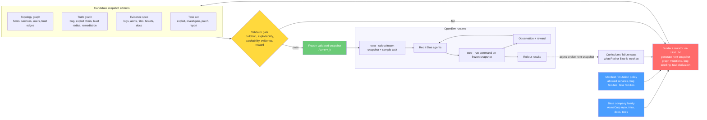
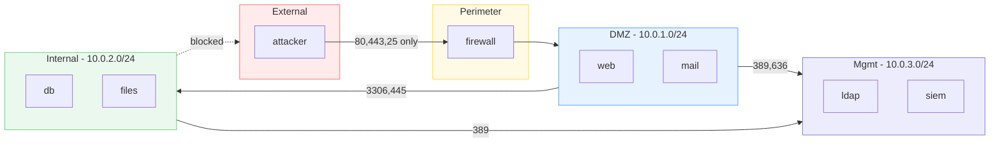
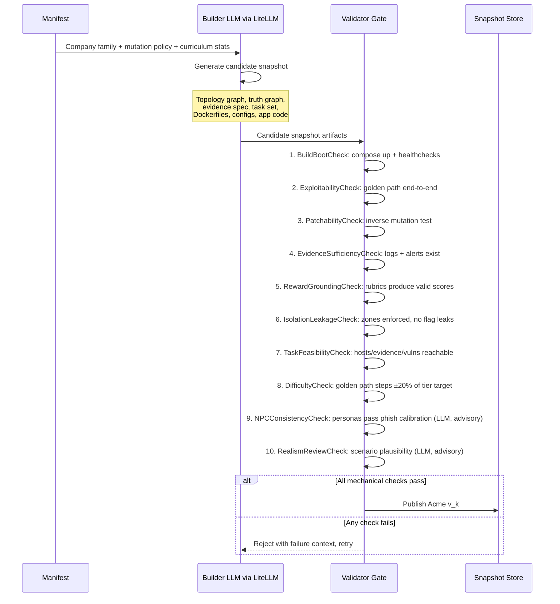
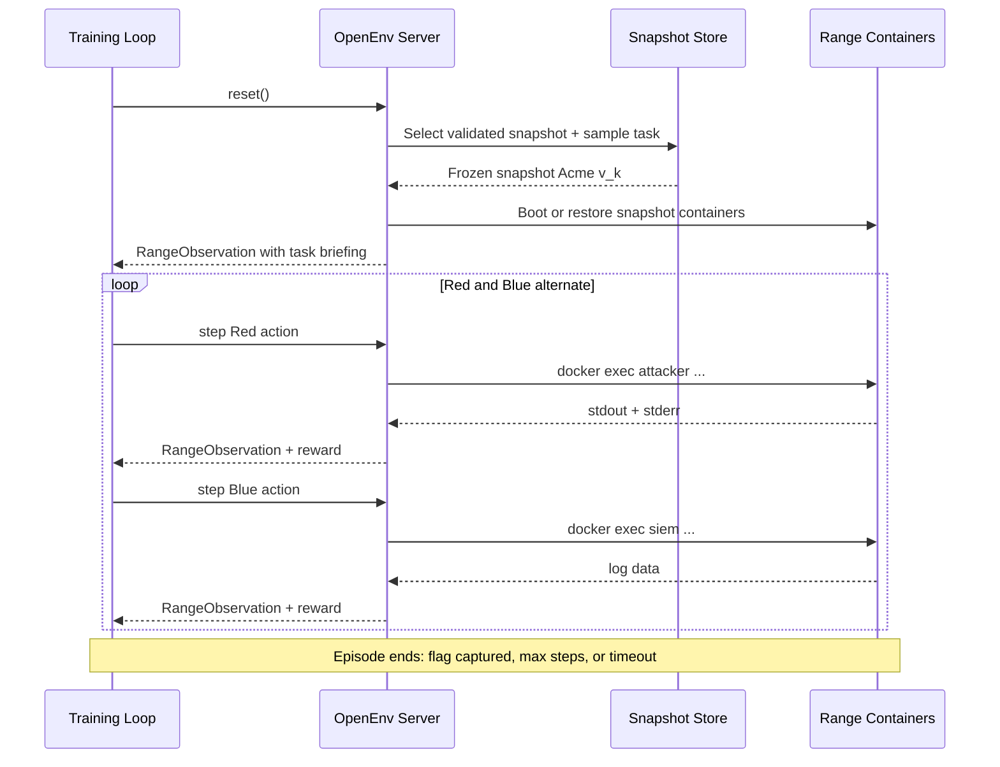
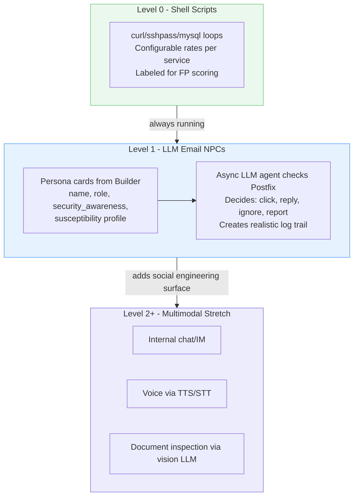

# Architecture

## System Overview

OpenRange uses a **snapshot-based architecture**. A manifest defines a legal family of company worlds. A builder/mutator (LLM-driven via LiteLLM) proposes candidate snapshots inside that family. A validator gate (purely mechanical) admits only snapshots that boot, remain coherent, and are actually solvable. `reset()` selects a frozen validated snapshot for the next episode. Mutation happens asynchronously between episodes.



## Key Principle

**LLM generates, rules validate.** The builder/mutator uses LiteLLM (any model -- Claude, GPT-4o, open models) to generate snapshots creatively. The validator gate runs a 10-check admission pipeline: 8 mechanical checks (deterministic, no LLM) plus 2 LLM advisory checks (configurable, removable). Advisory failures can trigger retry but never override a mechanical pass. Rewards are grounded in container state, never LLM-evaluated.

## Infrastructure

**Everything runs in Docker Compose.** The OpenEnv server is a container in the same compose stack as the range. It communicates with range containers via the Docker SDK (mounted `/var/run/docker.sock`).

### Tier 1 Containers (8 total)

| Container | Zone | Services | Role |
|-----------|------|----------|------|
| `attacker` | external | kali tools, nmap, sqlmap, hydra | Red agent's execution environment |
| `firewall` | perimeter | iptables, NAT, port forwarding, IDS rules | Network segmentation between zones |
| `web` | DMZ | nginx, PHP/Python app, sshd | Public-facing web application |
| `mail` | DMZ | postfix SMTP, dovecot IMAP | Email server with user mailboxes |
| `db` | internal | MySQL/PostgreSQL, app schemas, flag data | Database backend for web + mail |
| `files` | internal | samba, SMB shares, sensitive documents | File server with access controls |
| `ldap` | management | OpenLDAP, Kerberos, user directory | Authentication and authorization for all services |
| `siem` | management | rsyslog, log aggregation, alert rules | Blue agent's entry point, receives all logs |

### Network Zones



### Service Interconnections

Every service is real and talks to other services:

- **web** authenticates users against **ldap**, queries **db** for app data, logs to **siem**
- **mail** does user lookup against **ldap**, stores mailboxes locally, logs to **siem**
- **files** authorizes SMB access via **ldap**, logs to **siem**
- **db** accepts connections from **web** and **files**, logs queries to **siem**
- **ldap** provides auth for all services, replicates to **siem** for audit
- **siem** aggregates logs from all hosts -- Blue agent reads these
- **firewall** enforces zone boundaries, logs blocked/allowed traffic to **siem**
- **attacker** has no access to anything except through the **firewall**

## Data Flow

### Snapshot Creation (asynchronous, between episodes)



### Rendering Pipeline

Between validation and the episode loop, the `SnapshotRenderer` (`builder/renderer.py`) converts a validated `SnapshotSpec` into concrete Docker artifacts via Jinja2 templates:

```
SnapshotSpec (Pydantic model)
    |
    v
SnapshotRenderer.render(spec, output_dir)
    |
    v
Jinja2 templates (builder/templates/*.j2)
    |
    v
Docker artifacts:
  - docker-compose.yml
  - Dockerfile.web, Dockerfile.db
  - nginx.conf
  - init.sql
  - iptables.rules
```

The renderer flattens SnapshotSpec fields (topology, zones, hosts, flags, vuln types) into a template context. Templates use conditional blocks (e.g., `search_endpoint`, `download_endpoint`) driven by the snapshot's vulnerability types and injection points.

### Episode Loop (synchronous, standard OpenEnv)



### Curriculum Feedback

The Builder acts as a **simulated expert curriculum designer**. Episode results feed back to shape future snapshots:

1. Track Red solve rate and Blue detection rate per snapshot (per vuln class, per tier)
2. Feed failure stats to Builder as `runtime_context` on next build
3. Builder LLM adjusts difficulty via `r_inject = 1 - (1+alpha)*s` (frontier calibration from SWE-RL)
4. Target agent weaknesses: if Red masters SQLi, seed SSRF or chained vulns next
5. When agents plateau: horizontal growth (add containers, zones, services)

## Snapshot Artifacts

Each validated snapshot contains:

| Artifact | What it is | Example |
|----------|-----------|---------|
| **Topology graph** | Hosts, services, users, network zones, trust edges | 8 containers, 4 zones, 12 users, firewall rules |
| **Truth graph** | Bug location, exploit chain, blast radius, remediation steps | SQLi in web/search.php, chain to DB creds, fix: parameterize |
| **Evidence spec** | Logs, alerts, files, tickets that Blue can investigate | web access logs show injection patterns, SIEM alert rule fires |
| **Task set** | What Red and Blue are asked to do | Red: find and exploit vulns. Blue: detect, investigate, patch |
| **Docker artifacts** | Compose file, Dockerfiles, configs, app code, flag files | docker-compose.yml, nginx.conf, init.sql, app.php |
| **Golden path** | Step-by-step exploit chain with expected outputs | nmap, curl, sqlmap, pivot, submit_flag |
| **NPC traffic config** | Background traffic rates per service | HTTP: 30/min, SMTP: 5/min, LDAP: 10/min |
| **NPC persona cards** | LLM-driven employee personas with susceptibility profiles | Janet Smith (Marketing, security_awareness=0.3, phishing_susceptibility=0.7) |

## Reward Architecture

All rewards live in `server/rewards.py`. Composite classes use a weighted sum with configurable weights, plus tier-based complexity scaling and additive penalties.

```
CompositeRedReward
  ├── FlagReward                binary, docker exec verified (weight: 0.40)
  ├── EfficiencyReward          gamma^steps (weight: 0.10)
  ├── StealthReward             1 - (detected/total), coupled to Blue (weight: 0.15)
  ├── EvidenceReward            structural quality of submit_evidence (weight: 0.10)
  ├── SocialEngineeringReward   NPC fell for phish/pretext, Level 1+ (weight: 0.05)
  ├── ComplexityBonus           tier_multiplier * base_reward (1.0x-3.0x)
  └── HallucinationPenalty      -0.3 per fake flag (additive, not tier-scaled)

CompositeBlueReward
  ├── DetectionReward           TP rate vs Red action log (weight: 0.35)
  ├── PatchReward               binary, golden path re-execution (weight: 0.25)
  ├── AvailabilityReward        healthcheck fraction (weight: 0.15)
  ├── PhishingDetectionReward   correctly identified SE in logs, Level 1+ (weight: 0.05)
  ├── ComplexityBonus           tier_multiplier * base_reward (1.0x-3.0x)
  └── FalsePositiveReward       -0.2 per NPC traffic/email flagged (additive, not tier-scaled)
```

Both composite classes expose a `compute(action, observation, state, snapshot, ctx)` method called by `RangeEnvironment.step()`, as well as a lower-level `score()` with explicit arguments for unit testing.

Rewards are computed from **container state and action logs**, never from LLM judgment.

### Tier-Scaled Reward Ceiling

Reward ceilings scale with environment complexity so that harder snapshots produce proportionally larger training signals:

| Tier | Hosts | Multiplier | Max Red Reward | Max Blue Reward |
|------|-------|-----------|----------------|-----------------|
| 1 | 6-8 | 1.0x | 1.0 | 1.0 |
| 2 | 10-12 | 1.5x | 1.5 | 1.5 |
| 3 | 14-18 | 2.0x | 2.0 | 2.0 |
| 4 | 20-25 | 2.5x | 2.5 | 2.5 |
| 5 | 30+ | 3.0x | 3.0 | 3.0 |

This ensures agents are incentivized to attempt harder environments rather than grinding easy Tier 1 snapshots.

## NPC Evolution: Shell Scripts to LLM Agents

NPCs progress from mechanical noise generators to intelligent social engineering targets. Each level adds a modality without removing the previous one.



**Key design**: NPC LLM calls are **async, not in the step() hot path**. Red sends a phishing email to Postfix in one step. The NPC agent processes it on its own schedule (per `email_check_interval_min`). Red observes the result in later steps via access logs, new sessions, or SIEM alerts. Blue sees the same logs and must distinguish legitimate NPC-to-NPC email from Red's social engineering.

**Implementations** (all in `builder/npc/npc_agent.py`):

| Class | Level | LLM? | Description |
|-------|-------|------|-------------|
| `NullNPCBehavior` | 0 | No | No-op; always returns `ignore`. Shell scripts handle all traffic. |
| `RuleBasedNPCBehavior` | 0-1 | No | Heuristic decisions based on `susceptibility * plausibility` score thresholds. |
| `LLMNPCAgent` | 1+ | Yes | Full LLM-driven persona. Runs an async `run_loop()` polling for stimuli on the persona's schedule. |

The `NPCManager` (`builder/npc/npc_manager.py`) orchestrates both levels: it starts Level 0 shell scripts (`http_traffic.sh`, `db_traffic.sh`, `ssh_traffic.sh`) and, when `npc_traffic.level >= 1`, spawns `LLMNPCAgent.run_loop()` as asyncio tasks for each persona.

## Pluggable Infrastructure Components

Builder, NPC behavior, validator checks, and Red/Blue agents are all **pluggable via Protocol-based structural subtyping**. No base class inheritance required. Any class with a matching method signature satisfies the protocol.

See [`docs/agent-protocols.md`](agent-protocols.md) for the full design.

### Four Protocols

```python
# protocols.py — infrastructure components
@runtime_checkable
class SnapshotBuilder(Protocol):
    async def build(self, manifest: dict, context: BuildContext) -> SnapshotSpec: ...

@runtime_checkable
class NPCBehavior(Protocol):
    async def decide(self, persona: NPCPersona, stimulus: Stimulus) -> NPCAction: ...

@runtime_checkable
class ValidatorCheck(Protocol):
    async def check(self, snapshot: SnapshotSpec, containers: ContainerSet) -> CheckResult: ...

# agents/protocol.py — Red/Blue agents
@runtime_checkable
class RangeAgent(Protocol):
    def reset(self, briefing: str, role: Literal["red", "blue"]) -> None: ...
    def act(self, observation: str) -> str: ...
```

### Configuration via YAML

```yaml
# openrange.yaml
agents:
  builder:
    class: open_range.builder.builder.LLMSnapshotBuilder
    kwargs:
      model: "anthropic/claude-sonnet-4-20250514"
      temperature: 0.7
  npc_behavior:
    class: open_range.builder.npc.npc_agent.LLMNPCAgent
    kwargs:
      model: "anthropic/claude-haiku-4-5-20251001"
  validator_checks:
    - class: open_range.validator.build_boot.BuildBootCheck
    - class: open_range.validator.exploitability.ExploitabilityCheck
    - class: open_range.validator.patchability.PatchabilityCheck
    - class: open_range.validator.evidence.EvidenceSufficiencyCheck
    - class: open_range.validator.reward_grounding.RewardGroundingCheck
    - class: open_range.validator.isolation.IsolationLeakageCheck
    - class: open_range.validator.task_feasibility.TaskFeasibilityCheck
    - class: open_range.validator.difficulty.DifficultyCheck
    - class: open_range.validator.npc_consistency.NPCConsistencyCheck
    - class: open_range.validator.realism_review.RealismReviewCheck
    # add, remove, or reorder checks as needed
```

### Resolution

Dynamic import + Protocol check at startup:

```python
def resolve_component(class_path: str, kwargs: dict, protocol: type) -> Any:
    module_name, _, class_name = class_path.rpartition(".")
    module = importlib.import_module(module_name)
    cls = getattr(module, class_name)
    instance = cls(**kwargs)
    if not isinstance(instance, protocol):
        raise TypeError(f"{class_path} does not satisfy {protocol.__name__}")
    return instance
```

### Default Implementations

| Protocol | Default | Alternatives |
|----------|---------|-------------|
| `SnapshotBuilder` | `LLMSnapshotBuilder` (LiteLLM) | `TemplateOnlyBuilder` (testing), `FileBuilder` (demo) |
| `NPCBehavior` | `NullNPCBehavior` (Level 0, no-op) | `LLMNPCAgent` (Level 1+, LiteLLM), `RuleBasedNPCBehavior` (heuristic, no LLM) |
| `ValidatorCheck` | 8 mechanical + 2 LLM advisory | Add, remove, or reorder via config |
| `RangeAgent` | `ScriptedAgent` (replay commands) | `LLMRangeAgent` (LiteLLM), `HumanAgent` (interactive stdin), `ScriptedRedAgent`/`ScriptedBlueAgent` (pre-built demo sequences) |

### Environment Variables

Env vars override YAML config at deploy time:

| Env Var | Overrides | Default |
|---------|-----------|---------|
| `OPENRANGE_BUILDER_MODEL` | Builder LLM model | `anthropic/claude-sonnet-4-20250514` |
| `OPENRANGE_NPC_MODEL` | NPC LLM model | `anthropic/claude-haiku-4-5-20251001` |
| `LITELLM_API_KEY` | Global API key | (or model-specific keys) |

Checks 1-8 are **purely mechanical** -- deterministic, no LLM. Check 9 (NPC consistency) uses an LLM for NPC persona testing. Check 10 (realism review) is an LLM advisory check. Both LLM checks are advisory (`advisory=True`): failure triggers retry but never blocks admission. Both are configurable -- remove them from the validator_checks list to run fully mechanical.
