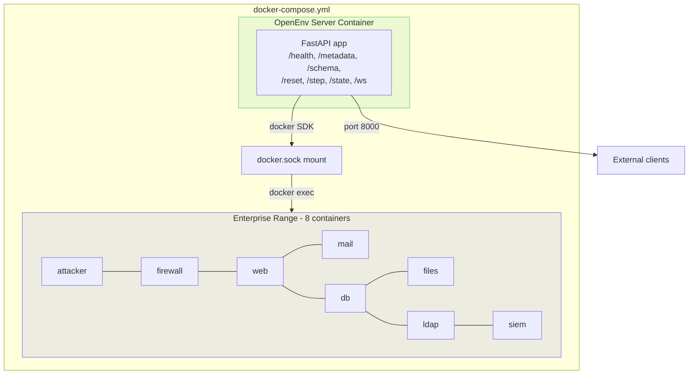

# OpenEnv Compliance Guide

OpenRange implements the OpenEnv 0.2.x environment contract. This doc maps every requirement.

## Checklist

| Requirement | Status | Implementation |
|-------------|--------|----------------|
| `Environment` subclass | Done | `RangeEnvironment` extends `Environment[RangeAction, RangeObservation, RangeState]` |
| `reset()` returns `ObsT` | Done | Returns `RangeObservation` with episode briefing |
| `step()` returns `ObsT` | Done | Returns `RangeObservation` with stdout/stderr/reward/done |
| `state` property returns `StateT` | Done | Returns `RangeState` (episode_id, step_count, mode, flags_found, services_status, tier) |
| `Action` subclass (Pydantic, extra=forbid) | Done | `RangeAction(Action)` with `command: str`, `mode: Literal["red", "blue"]` |
| `Observation` subclass (Pydantic, extra=forbid) | Done | `RangeObservation(Observation)` — inherits `done`, `reward` from base; adds `stdout`, `stderr`, `flags_captured`, `alerts` |
| `State` subclass (Pydantic, extra=allow) | Done | `RangeState(State)` — inherits `episode_id`, `step_count` from base; adds `mode`, `flags_found`, `services_status`, `tier` |
| `create_app(Class, ActionType, ObsType)` | Done | `open_range.server.app:create_app()` delegates directly to `openenv.core.env_server.create_app(...)` |
| `EnvClient` subclass | Done | `OpenRangeEnv(EnvClient[RangeAction, RangeObservation, RangeState])` |
| `_step_payload()` | Done | Returns `{"command": action.command, "mode": action.mode}` |
| `_parse_result()` | Done | Parses server response to `StepResult[RangeObservation]` |
| `_parse_state()` | Done | Parses server response to `RangeState` |
| `/health` endpoint | Done | Provided by `create_app(...)` |
| `/metadata` endpoint | Done | Provided by `create_app(...)` |
| `/schema` endpoint | Done | Provided by `create_app(...)` |
| `/ws` WebSocket | Done | Provided by `create_app(...)` |
| `/reset`, `/step`, `/state` HTTP | Done | Provided by `create_app(...)` |
| `Rubric` for rewards | Done | `CompositeRedReward`, `CompositeBlueReward` (lazy-loaded in `RangeEnvironment._apply_rewards`) |
| `openenv.yaml` manifest | Done | Root `openenv.yaml` with `spec_version`, `type`, `runtime`, `app`, and `port` |
| `Dockerfile` | Done | Root `Dockerfile` plus `server/Dockerfile`, both launching `uvicorn server.app:app` |
| `python -m open_range.server` entry point | Done | `open_range.server.__main__` plus `server` console script |

## Server Mode

The server entrypoint is the standard OpenEnv app factory:

- `open_range.server.app:create_app()` returns `create_app(RangeEnvironment, RangeAction, RangeObservation, env_name="open_range")`
- `server.app:app` is the repository-level wrapper referenced by `openenv.yaml`
- The OpenEnv-generated HTTP and WebSocket endpoints are the only public runtime contract

## Deployment

The OpenEnv server runs as a **container in the same Docker Compose stack** as the enterprise range. It reaches range containers via the Docker SDK (mounted `/var/run/docker.sock`).



`reset()` selects a pre-validated frozen snapshot from the snapshot store. No LLM calls in the hot path -- snapshot generation is asynchronous.

## Common Mistakes to Avoid

1. **Don't redeclare `done` or `reward` on Observation.** The base class already has them. `RangeObservation` correctly inherits them.
2. **Don't redeclare `episode_id` or `step_count` on State.** The base class already has them. `RangeState` correctly inherits them.
3. **Pass the CLASS to `create_app()`, not an instance.** Each WebSocket session gets its own instance. The standalone fallback also creates per-session instances for WebSocket.
4. **Action uses `extra="forbid"` (via openenv base).** Unknown fields cause validation errors. Keep actions minimal. Note: the fallback `Action` stub does not enforce `extra="forbid"`.
5. **State uses `extra="allow"`.** You can add any fields you want.
6. **`reset()` returns ObsT (server-side), `StepResult[ObsT]` (client-side).** The server wraps it.
7. **All openenv imports are guarded with try/except.** Models, environment, client, and app all fall back gracefully when openenv is not installed.

## API Signatures (Exact)

```python
# Server-side (src/open_range/server/environment.py)
class RangeEnvironment(Environment[RangeAction, RangeObservation, RangeState]):
    # Falls back to object base when openenv is not installed
    SUPPORTS_CONCURRENT_SESSIONS = False

    def __init__(self, max_steps: int = 100, exec_timeout: float = 30.0,
                 docker_available: bool | None = None) -> None: ...
    def reset(self, seed: int | None = None,
              episode_id: str | None = None, **kwargs) -> RangeObservation: ...
    def step(self, action: RangeAction,
             timeout_s: float | None = None, **kwargs) -> RangeObservation: ...
    @property
    def state(self) -> RangeState: ...

# Client-side (src/open_range/client/client.py)
class OpenRangeEnv(EnvClient[RangeAction, RangeObservation, RangeState]):
    # Falls back to a stub class when openenv is not installed
    def _step_payload(self, action: RangeAction) -> dict: ...
    def _parse_result(self, payload: dict) -> StepResult[RangeObservation]: ...
    def _parse_state(self, payload: dict) -> RangeState: ...

# App factory (src/open_range/server/app.py)
# Tries openenv's create_app first:
app = create_app(RangeEnvironment, RangeAction, RangeObservation, env_name="open_range")
# Falls back to standalone FastAPI app with equivalent HTTP + WebSocket endpoints

# Entry point (src/open_range/server/__main__.py)
# python -m open_range.server [--host HOST] [--port PORT] [--reload] [--log-level LEVEL]
```

## Reference Implementations

Study these OpenEnv environments as patterns:

- **`envs/coding_env/`** — closest analog (execute code, get stdout/stderr). Uses `Environment` base.
- **`envs/echo_env/`** — simplest possible environment. Uses `MCPEnvironment` base.
- **`envs/finqa_env/`** — MCP tool-based with complex rewards. Uses `MCPEnvironment` base.
